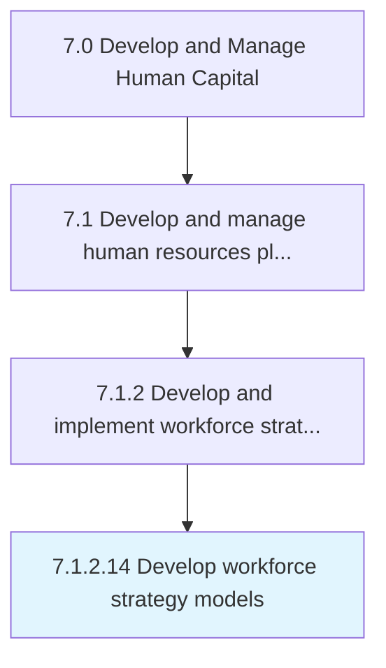

# Develop workforce strategy models

> Creating and implementing models for effectively strategizing the work force of the organization.

## Overview

Activity 7.1.2.14 is an activity within the Develop and Manage Human Capital framework. 

Creating and implementing models for effectively strategizing the work force of the organization. Develop a model that specifies the organization's overall approach for maximizing the performance of its work force by defining the goals, objectives, and expectations of the work force. Manage all aspects of performance required for the work force to function, including recruitment, selection, retention, and professional development.

## Process Hierarchy



## Key Statistics

| Metric | Value |
|--------|-------|
| APQC Code | 10433 |
| Hierarchy ID | 7.1.2.14 |
| Level | Activity |
| Parent | [7.1.2](../) |
| Sub-Processes | 0 |


## GraphDL Semantic Structure

```
develop.WorkforceStrategyModels
```

| Component | Value | Description |
|-----------|-------|-------------|
| Verb | `develop` | Primary action |
| Object | `workforce strategy models` | Direct object |


## Related Concepts

- WorkforceStrategyModels


---

*Source: APQC PCF 10433 (7.1.2.14) - APQC*
