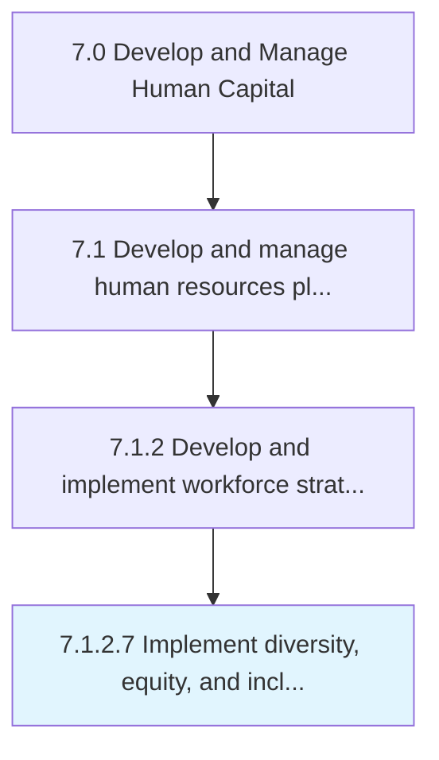
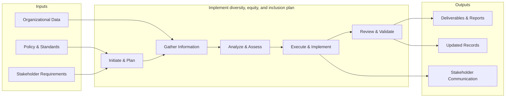

# Implement diversity, equity, and inclusion plan

> Execution of diversity, equity, and inclusion plans within an organization.

## Overview

Activity 7.1.2.7 is an activity within the Develop and Manage Human Capital framework. 

Execution of diversity, equity, and inclusion plans within an organization. Often called a DEI plan.

This process manages the implementation of diversity equity and inclusion plan from planning through execution and stabilization. It includes change management planning, resource mobilization, phased rollout, training delivery, and post-implementation review to ensure successful adoption.

## Process Hierarchy



## Key Statistics

| Metric | Value |
|--------|-------|
| APQC Code | 21433 |
| Hierarchy ID | 7.1.2.7 |
| Level | Activity |
| Parent | [7.1.2](../) |
| Sub-Processes | 0 |


## GraphDL Semantic Structure

```
implement.DiversityEquityAndInclusionPlan
```

| Component | Value | Description |
|-----------|-------|-------------|
| Verb | `implement` | Primary action |
| Object | `diversity, equity, and inclusion plan` | Direct object |


## Related Concepts

- Diversity
- Equity
- InclusionPlan


## Process Flow



## RACI Matrix

| Activity | Responsible | Accountable | Consulted | Informed |
|----------|------------|-------------|-----------|----------|
| Define HR strategy | HR Director | CHRO | C-Suite | All Employees |
| Allocate HR budget | HR Director | CFO | Finance | Department Heads |
| Design org structure | HR Business Partner | CHRO | Department Heads | Employees |

## Related Occupations

- [Human Resources Managers](/occupations/HumanResourcesManagers)
- [Compensation and Benefits Managers](/occupations/CompensationAndBenefitsManagers)
- [Training and Development Managers](/occupations/TrainingAndDevelopmentManagers)
- [Chief Executives](/occupations/ChiefExecutives)
- [Management Analysts](/occupations/ManagementAnalysts)

## Related Departments

- Human Resources
- Executive Leadership
- Finance

## Industry Variations

### Healthcare

Must account for clinical credentialing requirements, shift-based workforce models, and strict regulatory compliance (HIPAA, OSHA) when developing HR strategy.

### Technology

Focuses on rapid scaling, competitive talent markets, stock-based compensation strategies, and remote-first workforce planning.

### Manufacturing

Emphasizes union workforce considerations, safety certifications, skilled trade pipelines, and shift scheduling across multiple plant locations.

## KPIs & Metrics

| Metric | Description | Target |
|--------|-------------|--------|
| HR Cost per Employee | Total HR department cost divided by headcount | < $1,500/employee |
| HR-to-Employee Ratio | Number of HR FTEs per 100 employees | 1.0-1.4 per 100 |
| Strategic Alignment Score | Degree of HR strategy alignment with business objectives | > 80% |
| Workforce Plan Accuracy | Accuracy of headcount and skills forecasting | > 90% |

---

*Source: APQC PCF 21433 (7.1.2.7) - APQC*
