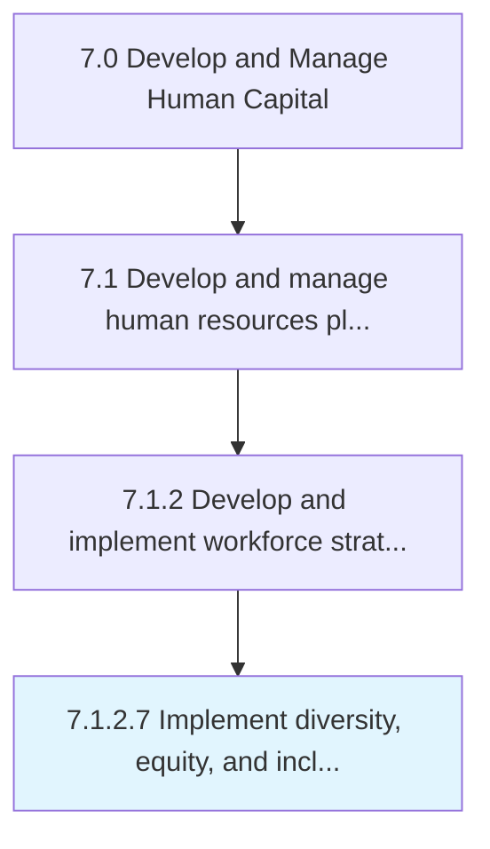

# Implement diversity, equity, and inclusion plan

> Execution of diversity, equity, and inclusion plans within an organization.

## Overview

Activity 7.1.2.7 is an activity within the Develop and Manage Human Capital framework. 

Execution of diversity, equity, and inclusion plans within an organization. Often called a DEI plan.

## Process Hierarchy



## Key Statistics

| Metric | Value |
|--------|-------|
| APQC Code | 21433 |
| Hierarchy ID | 7.1.2.7 |
| Level | Activity |
| Parent | [7.1.2](../) |
| Sub-Processes | 0 |


## GraphDL Semantic Structure

```
implement.DiversityEquityAndInclusionPlan
```

| Component | Value | Description |
|-----------|-------|-------------|
| Verb | `implement` | Primary action |
| Object | `diversity, equity, and inclusion plan` | Direct object |


## Related Concepts

- [Diversity](/concepts/Diversity)
- [Equity](/concepts/Equity)
- [InclusionPlan](/concepts/InclusionPlan)


---

*Source: APQC PCF 21433 (7.1.2.7) - APQC*
