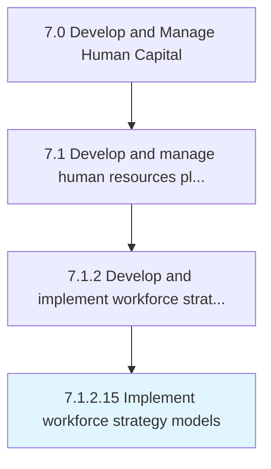

# Implement workforce strategy models

> Implementing models for effectively strategizing the work force of the organization.

## Overview

Activity 7.1.2.15 is an activity within the Develop and Manage Human Capital framework. 

Implementing models for effectively strategizing the work force of the organization. Carry out all aspects of performance required for the work force to function, including recruitment, selection, retention, and professional development.

## Process Hierarchy



## Key Statistics

| Metric | Value |
|--------|-------|
| APQC Code | 20122 |
| Hierarchy ID | 7.1.2.15 |
| Level | Activity |
| Parent | [7.1.2](../) |
| Sub-Processes | 0 |


## GraphDL Semantic Structure

```
implement.WorkforceStrategyModels
```

| Component | Value | Description |
|-----------|-------|-------------|
| Verb | `implement` | Primary action |
| Object | `workforce strategy models` | Direct object |


## Related Concepts

- [WorkforceStrategyModels](/concepts/WorkforceStrategyModels)


---

*Source: APQC PCF 20122 (7.1.2.15) - APQC*
