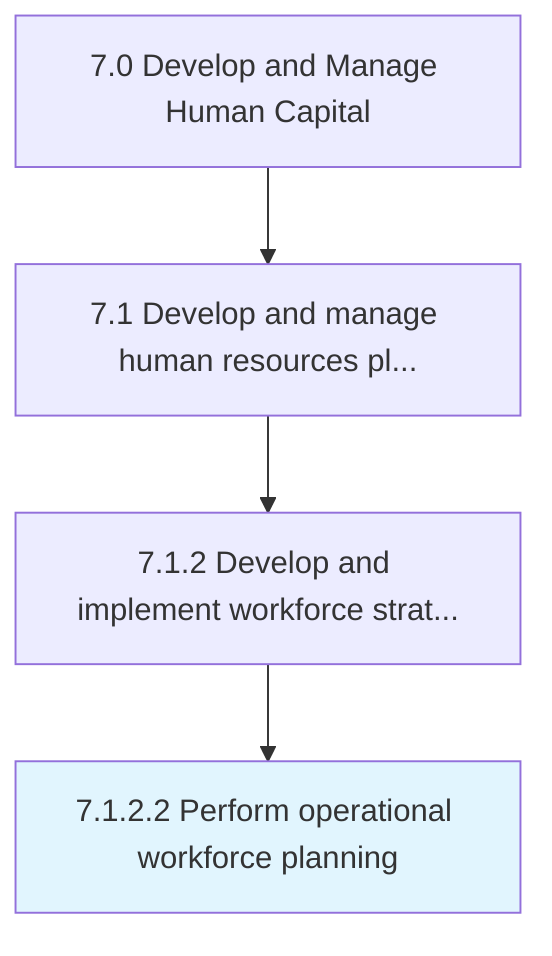

# Perform operational workforce planning

> Determining the requirements for employees and the need for employee resourcing for each every unit/function.

## Overview

Activity 7.1.2.2 is an activity within the Develop and Manage Human Capital framework. 

Determining the requirements for employees and the need for employee resourcing for each every unit/function. Lay out a plan detailing employee resourcing requirements of individual functions and the organization as a whole.

## Process Hierarchy



## Key Statistics

| Metric | Value |
|--------|-------|
| APQC Code | 10424 |
| Hierarchy ID | 7.1.2.2 |
| Level | Activity |
| Parent | [7.1.2](../) |
| Sub-Processes | 0 |


## GraphDL Semantic Structure

```
perform.OperationalWorkforcePlanning
```

| Component | Value | Description |
|-----------|-------|-------------|
| Verb | `perform` | Primary action |
| Object | `operational workforce planning` | Direct object |


## Related Concepts

- [OperationalWorkforcePlanning](/concepts/OperationalWorkforcePlanning)


---

*Source: APQC PCF 10424 (7.1.2.2) - APQC*
