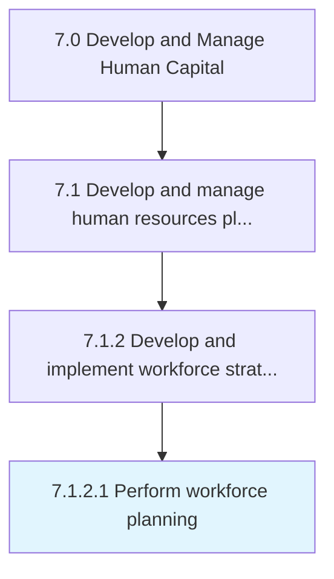

# Perform workforce planning

> Evaluating the current and future skill requirements of the organization with regard to the overall corporate strategy of the organization and market conditions.

## Overview

Activity 7.1.2.1 is an activity within the Develop and Manage Human Capital framework. 

Evaluating the current and future skill requirements of the organization with regard to the overall corporate strategy of the organization and market conditions. Identify and establish the minimum skills needed for the requisite HR needs.

## Process Hierarchy



## Key Statistics

| Metric | Value |
|--------|-------|
| APQC Code | 10423 |
| Hierarchy ID | 7.1.2.1 |
| Level | Activity |
| Parent | [7.1.2](../) |
| Sub-Processes | 0 |


## GraphDL Semantic Structure

```
perform.WorkforcePlanning
```

| Component | Value | Description |
|-----------|-------|-------------|
| Verb | `perform` | Primary action |
| Object | `workforce planning` | Direct object |


## Related Concepts

- WorkforcePlanning


---

*Source: APQC PCF 10423 (7.1.2.1) - APQC*
