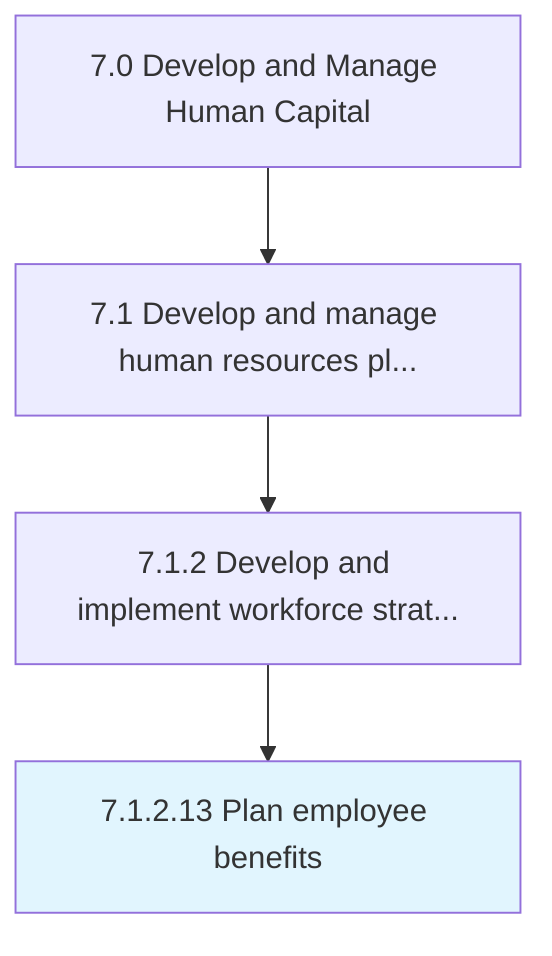

# Plan employee benefits

> Planning benefits in kind (also called fringe benefits, perquisites, or perks).

## Overview

Activity 7.1.2.13 is an activity within the Develop and Manage Human Capital framework. 

Planning benefits in kind (also called fringe benefits, perquisites, or perks). Include various types of non-wage compensations provided to employees in addition to normal wages or salaries.

## Process Hierarchy



## Key Statistics

| Metric | Value |
|--------|-------|
| APQC Code | 10431 |
| Hierarchy ID | 7.1.2.13 |
| Level | Activity |
| Parent | [7.1.2](../) |
| Sub-Processes | 0 |


## GraphDL Semantic Structure

```
plan.EmployeeBenefits
```

| Component | Value | Description |
|-----------|-------|-------------|
| Verb | `plan` | Primary action |
| Object | `employee benefits` | Direct object |


## Related Concepts

- EmployeeBenefits


---

*Source: APQC PCF 10431 (7.1.2.13) - APQC*
