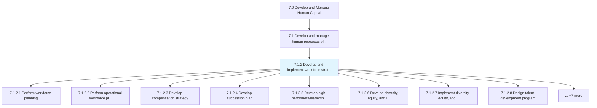
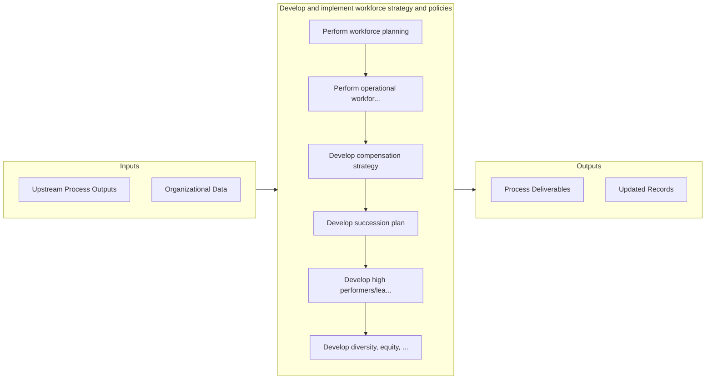

# Develop and implement workforce strategy and policies

> Creating and executing strategies and policies for smooth administration of work force.

## Overview

Process 7.1.2 is a core process that defines the specific procedures for develop and implement workforce strategy and policies. 

Creating and executing strategies and policies for smooth administration of work force. Determine and gather skill requirements. Plan the requirements for employee resourcing per unit. Create compensation, succession, HR program, and employee diversity plans. Develop and administer policies for HR. Develop benefits for employees. Create models for work force strategies.

## Process Hierarchy



## Key Statistics

| Metric | Value |
|--------|-------|
| APQC Code | 17045 |
| Hierarchy ID | 7.1.2 |
| Level | Process |
| Parent | [7.1](../) |
| Sub-Processes | 15 |


## GraphDL Semantic Structure

```
develop.AndImplementWorkforceStrategyAndPolicies
```

| Component | Value | Description |
|-----------|-------|-------------|
| Verb | `develop` | Primary action |
| Object | `and implement workforce strategy and policies` | Direct object |


## Process Flow



## Sub-Processes

| Process | Hierarchy ID | Description |
|---------|-------------|-------------|
| [Perform workforce planning](./PerformWorkforcePlanning) | 7.1.2.1 | Evaluating the current and future skill requirements of the organization with regard to the overall  |
| [Perform operational workforce planning](./PerformOperationalWorkforcePlanning) | 7.1.2.2 | Determining the requirements for employees and the need for employee resourcing for each every unit/ |
| [Develop compensation strategy](./7.1.2.3-DevelopCompensationStrategy/) | 7.1.2.3 | Designing a plan that specifies the combination of wages, salaries, and benefits the employees recei |
| [Develop succession plan](./DevelopSuccessionPlan) | 7.1.2.4 | Creating and implementing the plan for continuation of key positions within the organization |
| [Develop high performers/leadership programs](./DevelopHighPerformersleadershipPrograms) | 7.1.2.5 | Creating a program that incorporates incentives and compensation put forth by the organization to re |
| [Develop diversity, equity, and inclusion plan](./DevelopDiversityEquityAndInclusionPlan) | 7.1.2.6 | Creating and implementing the plan for ensuring a diverse work force |
| [Implement diversity, equity, and inclusion plan](./ImplementDiversityEquityAndInclusionPlan) | 7.1.2.7 | Execution of diversity, equity, and inclusion plans within an organization |
| [Design talent development program](./DesignTalentDevelopmentProgram) | 7.1.2.8 | Identifying skills, knowledge, and attributes that need enhancement in order to perform a job |
| [Design talent acquisition program](./DesignTalentAcquisitionProgram) | 7.1.2.9 | Developing a program to entice prospective resources to engage with the organization for a position  |
| [Develop other HR programs](./DevelopOtherHRPrograms) | 7.1.2.10 | Creating HR programs and services such as employee engagements programs to promote positive employee |
| [Develop HR policies](./DevelopHRPolicies) | 7.1.2.11 | Creating rules and regulations that govern the HR function |
| [Administer HR policies](./AdministerHRPolicies) | 7.1.2.12 | Ensuring rules and regulations are followed and are flexible enough to accommodate indispensable dev |
| [Plan employee benefits](./PlanEmployeeBenefits) | 7.1.2.13 | Planning benefits in kind (also called fringe benefits, perquisites, or perks) |
| [Develop workforce strategy models](./DevelopWorkforceStrategyModels) | 7.1.2.14 | Creating and implementing models for effectively strategizing the work force of the organization |
| [Implement workforce strategy models](./ImplementWorkforceStrategyModels) | 7.1.2.15 | Implementing models for effectively strategizing the work force of the organization |


## Related Concepts

- [WorkforceStrategy](/concepts/WorkforceStrategy)
- [Policies](/concepts/Policies)
- [WorkforceStrategy](/concepts/WorkforceStrategy)
- [Policies](/concepts/Policies)


---

*Source: APQC PCF 17045 (7.1.2) - APQC*
