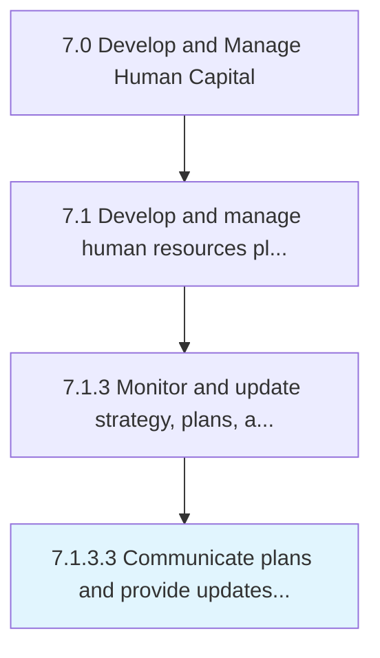

# Communicate plans and provide updates to stakeholders

> Conveying the plans for HR function to stakeholders.

## Overview

Activity 7.1.3.3 is an activity within the Develop and Manage Human Capital framework. 

Conveying the plans for HR function to stakeholders. Ensure that the HR plans and strategy are effectively communicated to the people who can affect or be affected by the organization's actions, objectives, and policies such as the creditors, shareholders, employees, and suppliers. Provide regular updates to these stakeholders to ensure effective communication.

## Process Hierarchy



## Key Statistics

| Metric | Value |
|--------|-------|
| APQC Code | 10436 |
| Hierarchy ID | 7.1.3.3 |
| Level | Activity |
| Parent | [7.1.3](../) |
| Sub-Processes | 0 |


## GraphDL Semantic Structure

```
communicate.PlansAndProvideUpdates.to.Stakeholders
```

| Component | Value | Description |
|-----------|-------|-------------|
| Verb | `communicate` | Primary action |
| Object | `plans and provide updates` | Direct object |
| Preposition | `to` | Relationship |
| PrepObject | `stakeholders` | Indirect object |


## Related Concepts

- PlansUpdates
- Stakeholders
- ProvideUpdates
- Stakeholders


---

*Source: APQC PCF 10436 (7.1.3.3) - APQC*
