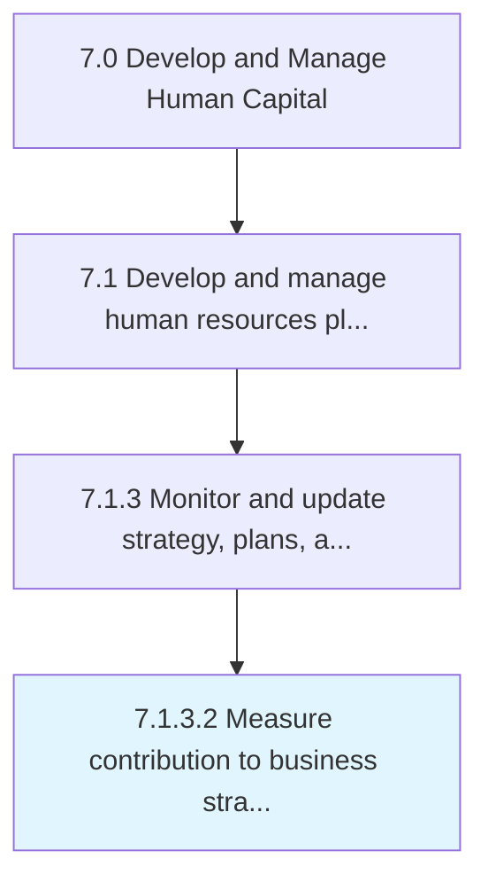

# Measure contribution to business strategy

> Determining the role of HR function in implementing the organizational strategy.

## Overview

Activity 7.1.3.2 is an activity within the Develop and Manage Human Capital framework. 

Determining the role of HR function in implementing the organizational strategy. Measure the correlation between the HR performance and the overall business strategy. Calculate the amount of contribution of the HR function to the overall business growth.

## Process Hierarchy



## Key Statistics

| Metric | Value |
|--------|-------|
| APQC Code | 10435 |
| Hierarchy ID | 7.1.3.2 |
| Level | Activity |
| Parent | [7.1.3](../) |
| Sub-Processes | 0 |


## GraphDL Semantic Structure

```
measure.Contribution.to.BusinessStrategy
```

| Component | Value | Description |
|-----------|-------|-------------|
| Verb | `measure` | Primary action |
| Object | `contribution` | Direct object |
| Preposition | `to` | Relationship |
| PrepObject | `business strategy` | Indirect object |


## Related Concepts

- [Contribution](/concepts/Contribution)
- [BusinessStrategy](/concepts/BusinessStrategy)


---

*Source: APQC PCF 10435 (7.1.3.2) - APQC*
