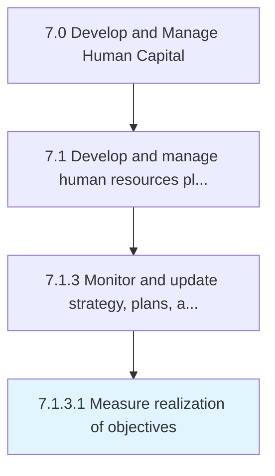
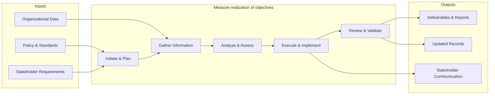
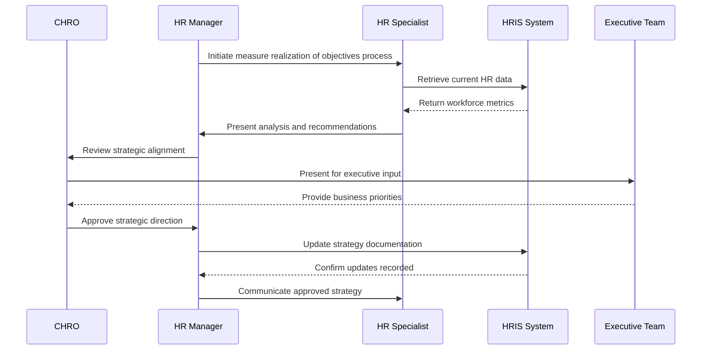

# Measure realization of objectives

> Determining the accomplishment of HR goals and objectives.

## Overview

Activity 7.1.3.1 is an activity within the Develop and Manage Human Capital framework. 

Determining the accomplishment of HR goals and objectives. Evaluate the effectiveness of the HR function by estimating the present rate of achievement of the established objectives. Use metrics to determine if the objectives are being realized. Leverage measures such as turnover, training, return on human capital, costs of labor, and expenses per employee.

This process encompasses the systematic execution of activities related to realization.of. objectives. It involves planning, coordination, execution, and evaluation to ensure outcomes align with organizational objectives and industry best practices. The process requires cross-functional collaboration and adherence to established policies and regulatory requirements.

## Process Hierarchy



## Key Statistics

| Metric | Value |
|--------|-------|
| APQC Code | 10434 |
| Hierarchy ID | 7.1.3.1 |
| Level | Activity |
| Parent | [7.1.3](../) |
| Sub-Processes | 0 |


## GraphDL Semantic Structure

```graphdl
measure.Realization.of.Objectives
```

| Component | Value | Description |
|-----------|-------|-------------|
| Verb | `measure` | Primary action |
| Object | `realization` | Direct object |
| Preposition | `of` | Relationship |
| PrepObject | `objectives` | Indirect object |


## Related Concepts

- Realization
- Objectives


## Process Flow



## Process Sequence



## RACI Matrix

| Activity | Responsible | Accountable | Consulted | Informed |
|----------|------------|-------------|-----------|----------|
| Define HR strategy | HR Director | CHRO | C-Suite | All Employees |
| Allocate HR budget | HR Director | CFO | Finance | Department Heads |
| Design org structure | HR Business Partner | CHRO | Department Heads | Employees |

## Related Occupations

- [Human Resources Managers](/occupations/Management/HumanResourcesManagers)
- [Compensation and Benefits Managers](/occupations/Management/CompensationAndBenefitsManagers)
- [Training and Development Managers](/occupations/Management/TrainingAndDevelopmentManagers)
- [Chief Executives](/occupations/Management/ChiefExecutives)
- [Management Analysts](/occupations/Business/Operations/ManagementAnalysts)

## Related Departments

- Human Resources
- Executive Leadership
- Finance

## Industry Variations

### Healthcare

Must account for clinical credentialing requirements, shift-based workforce models, and strict regulatory compliance (HIPAA, OSHA) when developing HR strategy.

### Technology

Focuses on rapid scaling, competitive talent markets, stock-based compensation strategies, and remote-first workforce planning.

### Manufacturing

Emphasizes union workforce considerations, safety certifications, skilled trade pipelines, and shift scheduling across multiple plant locations.

## KPIs & Metrics

| Metric | Description | Target |
|--------|-------------|--------|
| HR Cost per Employee | Total HR department cost divided by headcount | < $1,500/employee |
| HR-to-Employee Ratio | Number of HR FTEs per 100 employees | 1.0-1.4 per 100 |
| Strategic Alignment Score | Degree of HR strategy alignment with business objectives | > 80% |
| Workforce Plan Accuracy | Accuracy of headcount and skills forecasting | > 90% |

---

*Source: APQC PCF 10434 (7.1.3.1) - APQC*
