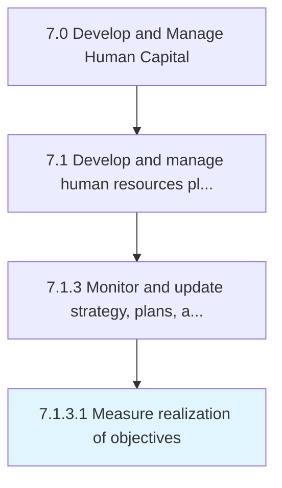

# Measure realization of objectives

> Determining the accomplishment of HR goals and objectives.

## Overview

Activity 7.1.3.1 is an activity within the Develop and Manage Human Capital framework. 

Determining the accomplishment of HR goals and objectives. Evaluate the effectiveness of the HR function by estimating the present rate of achievement of the established objectives. Use metrics to determine if the objectives are being realized. Leverage measures such as turnover, training, return on human capital, costs of labor, and expenses per employee.

## Process Hierarchy



## Key Statistics

| Metric | Value |
|--------|-------|
| APQC Code | 10434 |
| Hierarchy ID | 7.1.3.1 |
| Level | Activity |
| Parent | [7.1.3](../) |
| Sub-Processes | 0 |


## GraphDL Semantic Structure

```
measure.Realization.of.Objectives
```

| Component | Value | Description |
|-----------|-------|-------------|
| Verb | `measure` | Primary action |
| Object | `realization` | Direct object |
| Preposition | `of` | Relationship |
| PrepObject | `objectives` | Indirect object |


## Related Concepts

- Realization
- Objectives


---

*Source: APQC PCF 10434 (7.1.3.1) - APQC*
