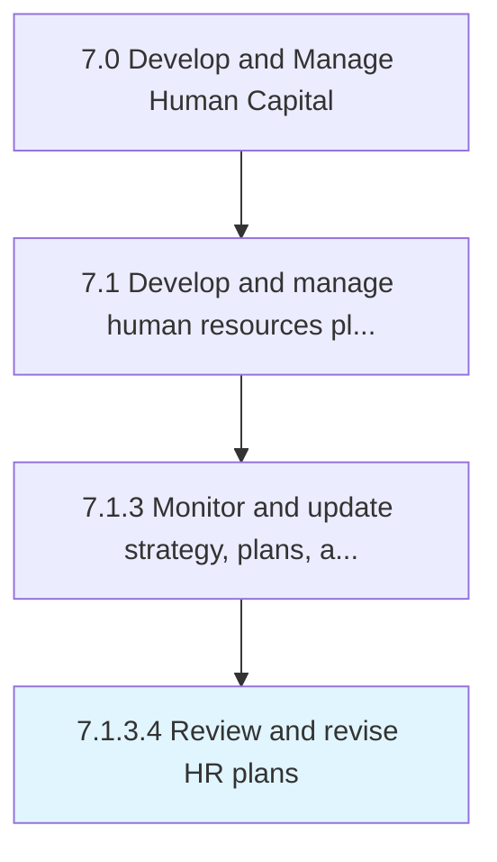

# Review and revise HR plans

> Reassessing the strategies, plans, and policies of the HR function, with the objective of revising them.

## Overview

Activity 7.1.3.4 is an activity within the Develop and Manage Human Capital framework. 

Reassessing the strategies, plans, and policies of the HR function, with the objective of revising them. Revisit the schematic plans for the HR function. Taking stock of any suggestions or feedback from the stakeholders, revamp the blueprint of HR strategies and plans.

## Process Hierarchy



## Key Statistics

| Metric | Value |
|--------|-------|
| APQC Code | 10438 |
| Hierarchy ID | 7.1.3.4 |
| Level | Activity |
| Parent | [7.1.3](../) |
| Sub-Processes | 0 |


## GraphDL Semantic Structure

```
review.AndReviseHRPlans
```

| Component | Value | Description |
|-----------|-------|-------------|
| Verb | `review` | Primary action |
| Object | `and revise HR plans` | Direct object |


## Related Concepts

- HRPlans
- HRPlans


---

*Source: APQC PCF 10438 (7.1.3.4) - APQC*
