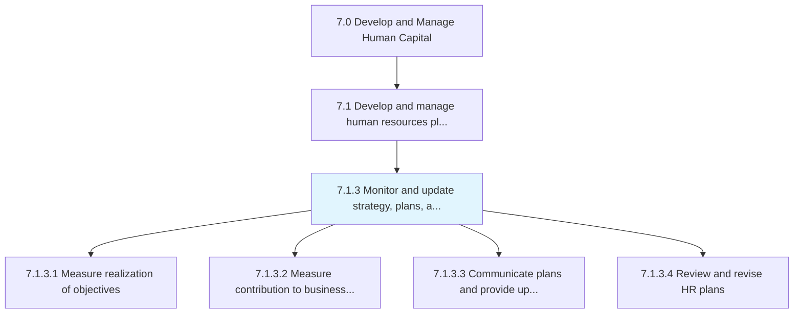
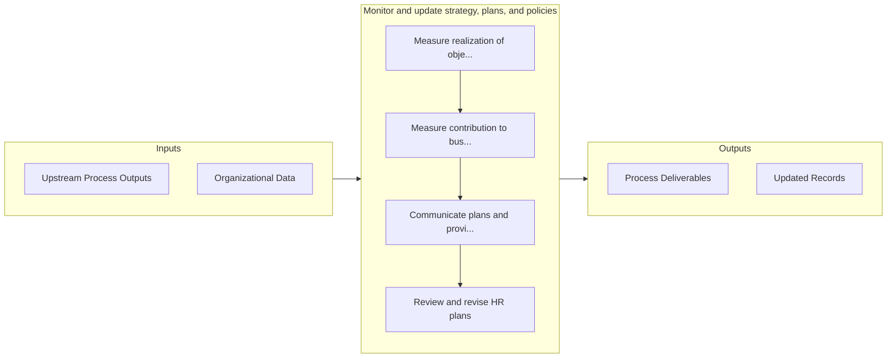

# Monitor and update strategy, plans, and policies

> Supervising the HR strategy, plans, and policies in order to refurbish them whenever needed.

## Overview

Process 7.1.3 is a core process that defines the specific procedures for monitor and update strategy, plans, and policies. 

Supervising the HR strategy, plans, and policies in order to refurbish them whenever needed. Determine the performance of HR plans and policies by measuring the objective achievement rate and its contribution to the overall business strategy. Ensure that information about these plans and strategies is effectively communicated to various stakeholders. Incorporate any suggestions by these stakeholders when revising HR plans and policies.

## Process Hierarchy



## Key Statistics

| Metric | Value |
|--------|-------|
| APQC Code | 10417 |
| Hierarchy ID | 7.1.3 |
| Level | Process |
| Parent | [7.1](../) |
| Sub-Processes | 4 |


## GraphDL Semantic Structure

```graphdl
monitor.AndUpdateStrategyPlansAndPolicies
```

| Component | Value | Description |
|-----------|-------|-------------|
| Verb | `monitor` | Primary action |
| Object | `and update strategy, plans, and policies` | Direct object |


## Process Flow



## Sub-Processes

| Process | Hierarchy ID | Description |
|---------|-------------|-------------|
| [Measure realization of objectives](./MeasureRealizationOfObjectives) | 7.1.3.1 | Determining the accomplishment of HR goals and objectives |
| [Measure contribution to business strategy](./MeasureContributionToBusinessStrategy) | 7.1.3.2 | Determining the role of HR function in implementing the organizational strategy |
| [Communicate plans and provide updates to stakeholders](./CommunicatePlansAndProvideUpdatesToStakeholders) | 7.1.3.3 | Conveying the plans for HR function to stakeholders |
| [Review and revise HR plans](./ReviewAndReviseHRPlans) | 7.1.3.4 | Reassessing the strategies, plans, and policies of the HR function, with the objective of revising t |


## Related Concepts

- Strategy
- Plans
- Policies
- Strategy
- Plans
- Policies


---

*Source: APQC PCF 10417 (7.1.3) - APQC*
