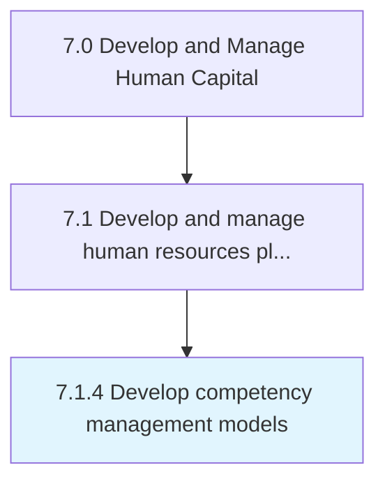
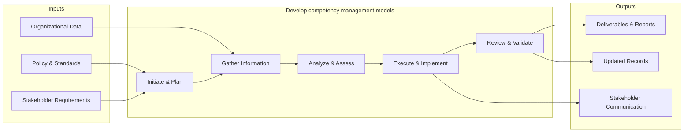

# Develop competency management models

> Creating and implementing the tools for managing the competency levels of HR.

## Overview

Process 7.1.4 is a core process that defines the specific procedures for develop competency management models. 

Creating and implementing the tools for managing the competency levels of HR. Design a model for integrating HR planning with business planning. Assess current HR capacity based on the competencies against the capacity needed to achieve the vision, mission, and business goals of the organization. Consider factors such as employee development, career path, compensation policies, and performance management.

This process encompasses the end-to-end development of competency management models, from initial needs assessment through design, implementation, and evaluation. It requires cross-functional collaboration, alignment with organizational objectives, and iterative refinement based on stakeholder feedback and performance metrics.

## Process Hierarchy



## Key Statistics

| Metric | Value |
|--------|-------|
| APQC Code | 17046 |
| Hierarchy ID | 7.1.4 |
| Level | Process |
| Parent | [7.1](../) |
| Sub-Processes | 0 |


## GraphDL Semantic Structure

```
develop.CompetencyManagementModels
```

| Component | Value | Description |
|-----------|-------|-------------|
| Verb | `develop` | Primary action |
| Object | `competency management models` | Direct object |


## Related Concepts

- CompetencyManagementModels


## Process Flow



## RACI Matrix

| Activity | Responsible | Accountable | Consulted | Informed |
|----------|------------|-------------|-----------|----------|
| Define HR strategy | HR Director | CHRO | C-Suite | All Employees |
| Allocate HR budget | HR Director | CFO | Finance | Department Heads |
| Design org structure | HR Business Partner | CHRO | Department Heads | Employees |

## Related Occupations

- [Human Resources Managers](/occupations/HumanResourcesManagers)
- [Compensation and Benefits Managers](/occupations/CompensationAndBenefitsManagers)
- [Training and Development Managers](/occupations/TrainingAndDevelopmentManagers)
- [Chief Executives](/occupations/ChiefExecutives)
- [Management Analysts](/occupations/ManagementAnalysts)

## Related Departments

- Human Resources
- Executive Leadership
- Finance

## Industry Variations

### Healthcare

Must account for clinical credentialing requirements, shift-based workforce models, and strict regulatory compliance (HIPAA, OSHA) when developing HR strategy.

### Technology

Focuses on rapid scaling, competitive talent markets, stock-based compensation strategies, and remote-first workforce planning.

### Manufacturing

Emphasizes union workforce considerations, safety certifications, skilled trade pipelines, and shift scheduling across multiple plant locations.

## KPIs & Metrics

| Metric | Description | Target |
|--------|-------------|--------|
| HR Cost per Employee | Total HR department cost divided by headcount | < $1,500/employee |
| HR-to-Employee Ratio | Number of HR FTEs per 100 employees | 1.0-1.4 per 100 |
| Strategic Alignment Score | Degree of HR strategy alignment with business objectives | > 80% |
| Workforce Plan Accuracy | Accuracy of headcount and skills forecasting | > 90% |

---

*Source: APQC PCF 17046 (7.1.4) - APQC*
