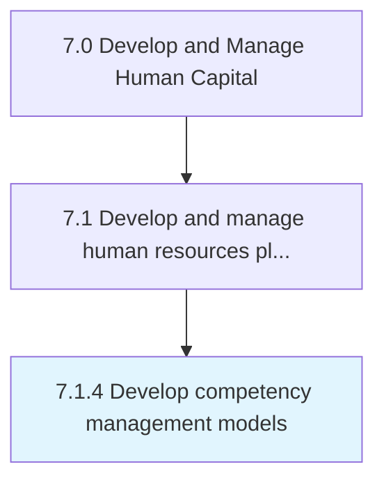

# Develop competency management models

> Creating and implementing the tools for managing the competency levels of HR.

## Overview

Process 7.1.4 is a core process that defines the specific procedures for develop competency management models. 

Creating and implementing the tools for managing the competency levels of HR. Design a model for integrating HR planning with business planning. Assess current HR capacity based on the competencies against the capacity needed to achieve the vision, mission, and business goals of the organization. Consider factors such as employee development, career path, compensation policies, and performance management.

## Process Hierarchy



## Key Statistics

| Metric | Value |
|--------|-------|
| APQC Code | 17046 |
| Hierarchy ID | 7.1.4 |
| Level | Process |
| Parent | [7.1](../) |
| Sub-Processes | 0 |


## GraphDL Semantic Structure

```
develop.CompetencyManagementModels
```

| Component | Value | Description |
|-----------|-------|-------------|
| Verb | `develop` | Primary action |
| Object | `competency management models` | Direct object |


## Related Concepts

- [CompetencyManagementModels](/concepts/CompetencyManagementModels)


---

*Source: APQC PCF 17046 (7.1.4) - APQC*
