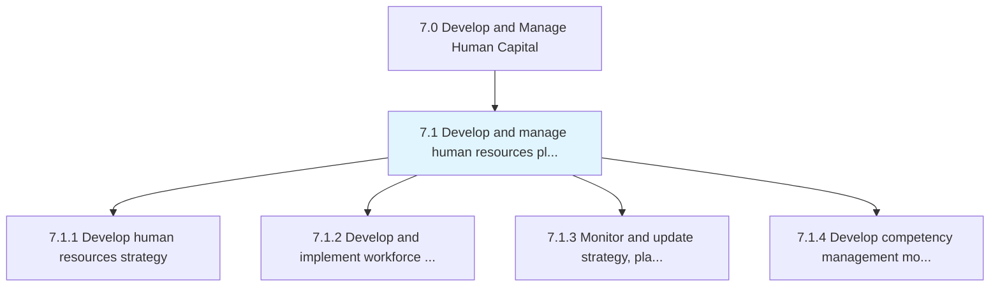
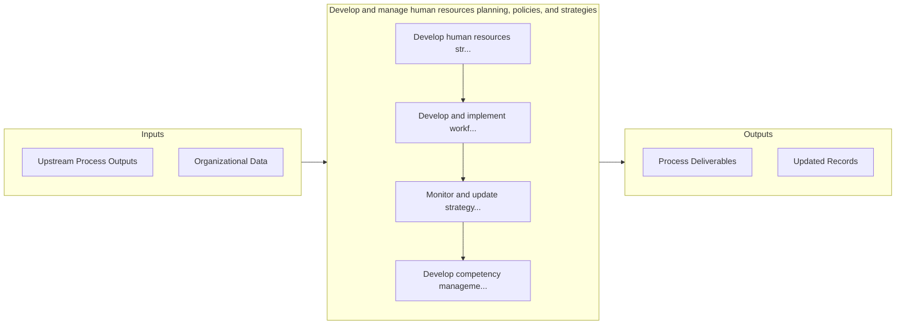

# Develop and manage human resources planning, policies, and strategies

> Creating strategies for the HR function.

## Overview

Group 7.1 is a process group within APQC Category 7.0 (Develop and Manage Human Capital). 

Creating strategies for the HR function. Create and implement strategies for managing the work force. Supervise and enhance the strategies, plans, and policies supporting the HR function. Developing models for managing competency levels of the HR of the organization.

## Process Hierarchy



## Key Statistics

| Metric | Value |
|--------|-------|
| APQC Code | 17043 |
| Hierarchy ID | 7.1 |
| Level | Group |
| Parent | [7](../) |
| Sub-Processes | 4 |


## GraphDL Semantic Structure

```graphdl
develop.AndManageHumanResourcesPlanningPoliciesAndStrategies
```

| Component | Value | Description |
|-----------|-------|-------------|
| Verb | `develop` | Primary action |
| Object | `and manage human resources planning, policies, and strategies` | Direct object |


## Process Flow



## Sub-Processes

| Process | Hierarchy ID | Description |
|---------|-------------|-------------|
| [Develop human resources strategy](./7.1.1-DevelopHumanResourcesStrategy/) | 7.1.1 | Creating a long-term plan to associate human resource requirements with the strategic goals of the c |
| [Develop and implement workforce strategy and policies](./7.1.2-DevelopImplementWorkforceStrategy/) | 7.1.2 | Creating and executing strategies and policies for smooth administration of work force |
| [Monitor and update strategy, plans, and policies](./7.1.3-MonitorUpdateStrategyPlans/) | 7.1.3 | Supervising the HR strategy, plans, and policies in order to refurbish them whenever needed |
| [Develop competency management models](./DevelopCompetencyManagementModels) | 7.1.4 | Creating and implementing the tools for managing the competency levels of HR |


## Related Concepts

- HumanResourcesPlanning
- Policies
- Strategies
- HumanResourcesPlanning
- Policies
- Strategies


---

*Source: APQC PCF 17043 (7.1) - APQC*
