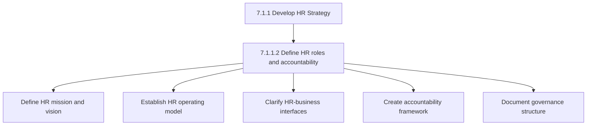
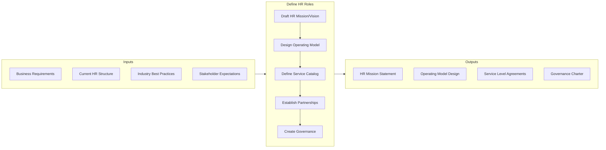
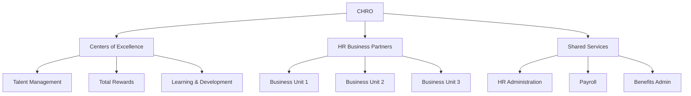

# Define HR and Business Function Roles and Accountability

> Outlining the charge and duty of the HR function by defining its responsibility areas, as well as ensuring its accountability. Establish the HR function by laying out the roles and responsibilities for this function and the rules and regulations guiding HR. Define the goals and objectives of the HR, as well as a mission and vision for this function.

## Overview

Activity 7.1.1.2 establishes the operating model for the HR function. It defines how HR interacts with business units, clarifies service delivery responsibilities, and creates accountability frameworks. This activity is essential for ensuring that HR operates as a strategic partner rather than merely an administrative function.

Modern HR operating models range from centralized to decentralized, with many organizations adopting hybrid approaches that combine shared services, centers of excellence, and embedded HR business partners.

## Process Hierarchy



## Key Statistics

| Metric | Value |
|--------|-------|
| APQC Code | 10419 |
| Hierarchy ID | 7.1.1.2 |
| Level | Activity |
| Parent | [7.1.1 Develop HR Strategy](../) |

## Process Flow



## GraphDL Semantic Structure

```graphdl
define.HRRolesAndAccountability
```

| Component | Value | Description |
|-----------|-------|-------------|
| Verb | `define` | Establishing and documenting |
| Object | `HRRolesAndAccountability` | HR function structure |

## HR Operating Models

### Three Pillar Model



### Role Definitions

| Role | Responsibility | Accountability |
|------|----------------|----------------|
| CHRO | Strategic leadership | Board, CEO |
| HR Business Partner | Business alignment | Business unit heads |
| CoE Leader | Functional expertise | CHRO |
| Shared Services | Transactional efficiency | CHRO |
| HR Generalist | Local HR delivery | HRBP |

## RACI Matrix

| Activity | Responsible | Accountable | Consulted | Informed |
|----------|-------------|-------------|-----------|----------|
| Define mission/vision | HR Leadership | CHRO | CEO | All HR |
| Design operating model | HR Strategy | CHRO | Business leaders | Employees |
| Define service levels | HR Operations | CHRO | Business units | Finance |
| Establish governance | HR Leadership | CHRO | Legal | All HR |

## Industry Variations

### Technology Companies

Embedded HR model with HRBPs closely integrated into product teams.

### Manufacturing

Regional HR structure with plant-level HR generalists.

### Financial Services

Highly centralized with strong compliance oversight.

## Metrics & KPIs

| Metric | Description | Target |
|--------|-------------|--------|
| Role Clarity Score | Employees understanding HR touchpoints | >85% |
| SLA Compliance | Service level achievement | >95% |
| HR:Employee Ratio | HR FTEs per employee | 1:80-1:120 |
| Business Satisfaction | HRBP effectiveness rating | >4.0/5.0 |

---

*Source: APQC PCF 10419 (7.1.1.2) - Cross-Industry*
