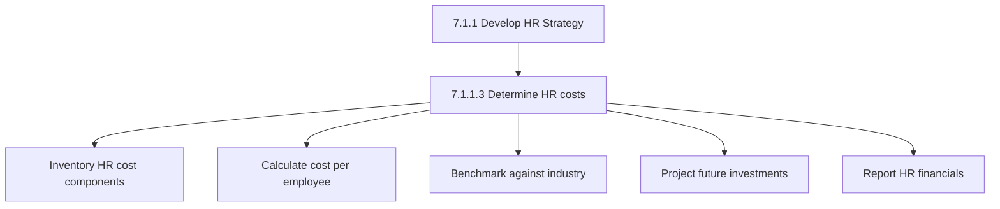
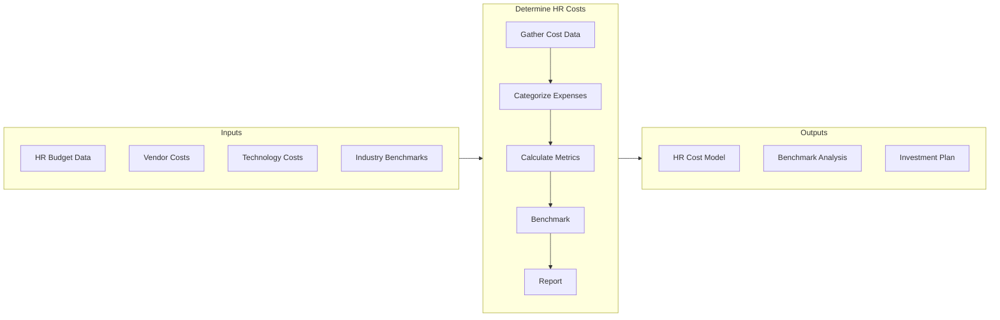

# Determine HR Costs

> Ascertaining the costs and expenses of the HR function. Identify and report HR investments using, for example, a cost approach or a present value of future earnings approach.

## Overview

Activity 7.1.1.3 focuses on understanding the total cost of the HR function and ensuring that HR investments deliver appropriate return. This includes direct HR department costs, technology investments, and the broader costs of people programs delivered through HR.

Effective HR cost management requires transparency about spending, benchmarking against industry standards, and demonstrating the value delivered relative to investment.

## Process Hierarchy



## Key Statistics

| Metric | Value |
|--------|-------|
| APQC Code | 10420 |
| Hierarchy ID | 7.1.1.3 |
| Level | Activity |
| Parent | [7.1.1 Develop HR Strategy](../) |

## Process Flow



## GraphDL Semantic Structure

```graphdl
determine.HRCosts
```

| Component | Value | Description |
|-----------|-------|-------------|
| Verb | `determine` | Calculating and analyzing |
| Object | `HRCosts` | HR function expenses |

## HR Cost Categories

### Direct HR Costs

| Category | Components | Typical % |
|----------|------------|-----------|
| HR Staff | Salaries, benefits, training | 40-50% |
| HR Technology | HRIS, ATS, LMS licenses | 15-25% |
| Outsourced Services | Payroll, benefits admin | 10-20% |
| Recruiting | Agency fees, job boards, events | 10-15% |
| Learning & Development | Training programs, content | 5-10% |

### HR Cost Benchmarks

| Metric | Median | Top Quartile |
|--------|--------|--------------|
| HR Cost per Employee | $2,500 | $1,800 |
| HR FTE Ratio | 1:100 | 1:120 |
| HR as % of Revenue | 0.8% | 0.5% |
| Technology per Employee | $150 | $100 |

## RACI Matrix

| Activity | Responsible | Accountable | Consulted | Informed |
|----------|-------------|-------------|-----------|----------|
| Gather cost data | HR Finance | CHRO | Finance | HR leaders |
| Calculate metrics | HR Analytics | CHRO | Finance | Budget owners |
| Benchmark | HR Strategy | CHRO | External | Leadership |
| Report financials | HR Finance | CHRO | CFO | Board |

## Industry Variations

### Professional Services
Higher HR costs driven by talent acquisition and development in knowledge-intensive industries.

### Manufacturing
Lower per-employee costs but higher compliance/safety training investments.

### Healthcare
Significant credentialing and compliance costs elevate HR spending.

## Metrics & KPIs

| Metric | Description | Target |
|--------|-------------|--------|
| HR Cost per Employee | Total HR spend / headcount | <$2,500 |
| HR as % Revenue | HR budget / total revenue | <1% |
| Cost per Hire | Total recruiting cost / hires | <$5,000 |
| Training Cost per Employee | L&D spend / headcount | $1,000-2,000 |
| HR Technology ROI | Value delivered / tech cost | >300% |

---

*Source: APQC PCF 10420 (7.1.1.3) - Cross-Industry*
