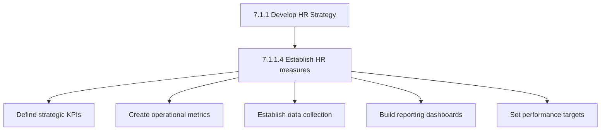
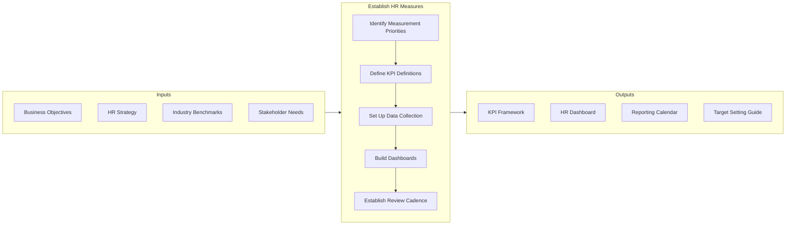
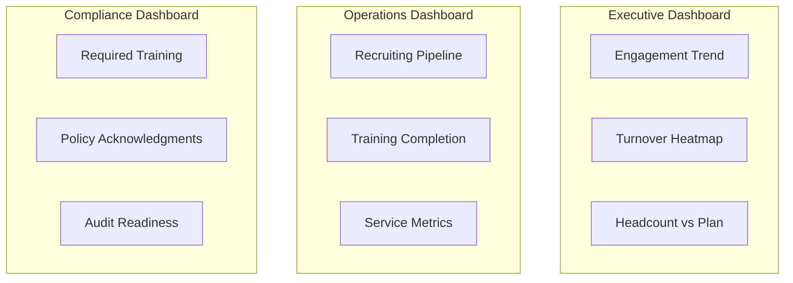

# Establish HR Measures

> Evaluating the performance of HR function. Lay out the course of HR procedures that would formulate a plan of action needed to fulfill strategic HR needs. Deploy measures such as hiring policies, leave management, internal code of conducts, and compensation structure.

## Overview

Activity 7.1.1.4 creates the measurement framework that enables HR to demonstrate value and drive continuous improvement. This includes defining key performance indicators, establishing data collection processes, and creating reporting mechanisms.

Effective HR measurement balances lagging indicators (outcomes) with leading indicators (predictive metrics) and connects HR activities to business results.

## Process Hierarchy



## Key Statistics

| Metric | Value |
|--------|-------|
| APQC Code | 10421 |
| Hierarchy ID | 7.1.1.4 |
| Level | Activity |
| Parent | [7.1.1 Develop HR Strategy](../) |

## Process Flow



## GraphDL Semantic Structure

```
establish.HRMeasures
```

| Component | Value | Description |
|-----------|-------|-------------|
| Verb | `establish` | Creating and implementing |
| Object | `HRMeasures` | HR performance metrics |

## HR Measurement Framework

### Strategic Metrics (Board/C-Suite Level)

| Metric | Definition | Frequency |
|--------|------------|-----------|
| Employee Engagement | Annual survey score | Annual |
| Total Turnover | Separations / avg headcount | Monthly |
| Revenue per Employee | Revenue / FTEs | Quarterly |
| Time to Productivity | Days for new hire to full productivity | Quarterly |
| Leadership Bench Strength | Ready-now successors for key roles | Annual |

### Operational Metrics (HR Leadership Level)

| Metric | Definition | Frequency |
|--------|------------|-----------|
| Time to Fill | Req open to start date | Monthly |
| Cost per Hire | Recruiting costs / hires | Monthly |
| Training Hours per Employee | Total hours / headcount | Quarterly |
| HR Cost per Employee | HR budget / headcount | Annual |
| Benefits Participation | Enrolled / eligible | Annual |

### Transactional Metrics (HR Operations Level)

| Metric | Definition | Frequency |
|--------|------------|-----------|
| Payroll Accuracy | Correct payments / total | Per pay period |
| Ticket Resolution Time | Avg time to close HR tickets | Weekly |
| Self-Service Adoption | Transactions via self-service | Monthly |
| Compliance Training Completion | Completed / required | Monthly |

## Dashboard Design



## RACI Matrix

| Activity | Responsible | Accountable | Consulted | Informed |
|----------|-------------|-------------|-----------|----------|
| Define KPIs | HR Analytics | CHRO | Business leaders | HR team |
| Set up data collection | HRIS Team | CHRO | IT | HR operations |
| Build dashboards | HR Analytics | CHRO | Stakeholders | All HR |
| Set targets | HR Leadership | CHRO | Finance | Budget owners |
| Review performance | HR Analytics | CHRO | Executive team | All HR |

## Industry Variations

### Technology
Focus on time-to-hire, offer acceptance rates, and engineering productivity.

### Healthcare
Emphasis on credential compliance, mandatory training, and patient safety metrics.

### Retail
Priority on seasonal hiring velocity, turnover by location, and labor scheduling efficiency.

## Metrics & KPIs

| Metric | Description | Target |
|--------|-------------|--------|
| Data Accuracy | Clean data in HRIS | >95% |
| Report Automation | Automated vs manual reports | >80% |
| Dashboard Usage | HR leaders using dashboards | >90% |
| Metric Coverage | Processes with KPIs defined | >80% |

---

*Source: APQC PCF 10421 (7.1.1.4) - Cross-Industry*
