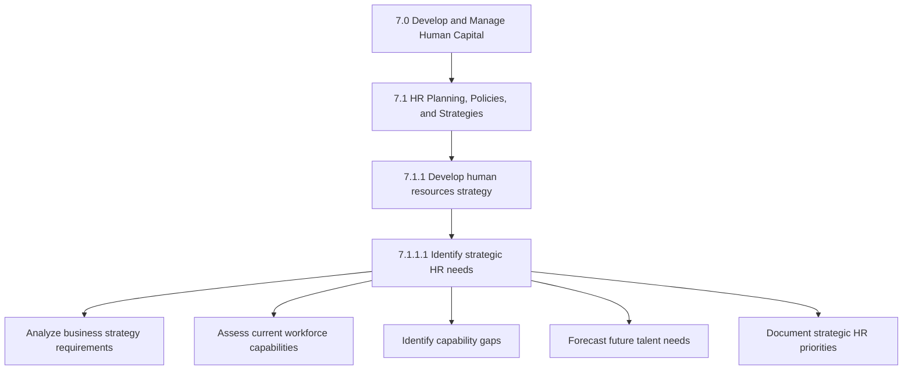
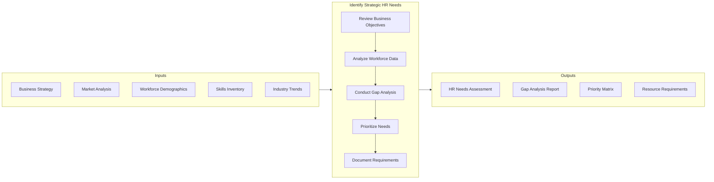
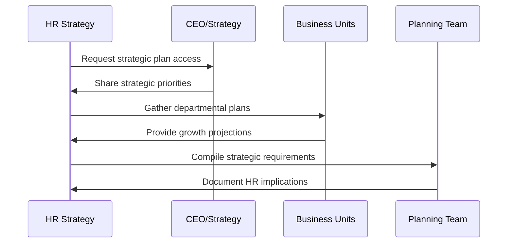
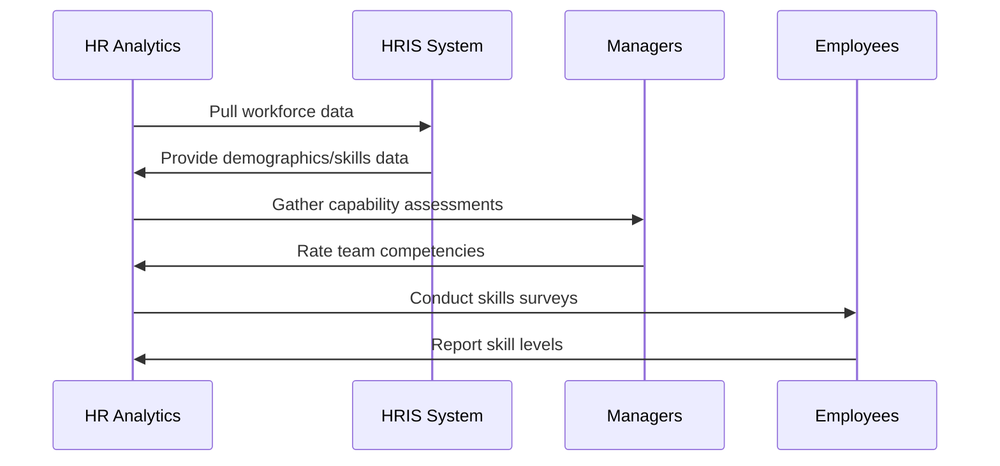
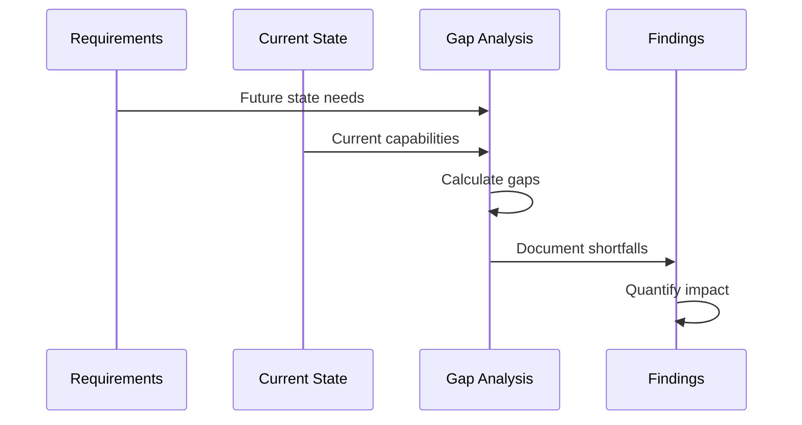

# Identify Strategic HR Needs

> Strategically defining the current and future needs for developing an efficient HR strategy.

## Overview

Activity 7.1.1.1 is the foundational step in strategic HR planning. It involves analyzing business objectives, assessing current workforce capabilities, and identifying gaps that must be addressed through HR initiatives. This activity ensures that HR efforts are purposefully directed toward supporting organizational success.

Strategic HR needs identification requires both quantitative analysis of workforce data and qualitative understanding of business direction. The output of this activity drives all subsequent HR strategy decisions.

## Process Hierarchy



## Key Statistics

| Metric | Value |
|--------|-------|
| APQC Code | 10418 |
| Hierarchy ID | 7.1.1.1 |
| Level | Activity |
| Category | [Human Capital](/processes/07-HR) |
| Parent | [7.1.1 Develop HR Strategy](../) |

## Process Flow



## GraphDL Semantic Structure

```
identify.StrategicHRNeeds
```

| Component | Value | Description |
|-----------|-------|-------------|
| Verb | `identify` | Discovering and defining |
| Object | `StrategicHRNeeds` | HR requirements aligned to strategy |

## Detailed Tasks

### Task 1: Review Business Strategy and Objectives

Analyze organizational strategic plans to understand the direction and priorities that HR must support.



**Key Considerations:**
- Revenue growth targets and their staffing implications
- Geographic expansion plans
- New product/service launches requiring new skills
- Digital transformation initiatives
- M&A activity and integration needs

### Task 2: Assess Current Workforce Capabilities

Evaluate the existing workforce in terms of skills, competencies, capacity, and demographic composition.



**Assessment Dimensions:**
- Technical skills inventory
- Leadership pipeline strength
- Critical role bench depth
- Age/tenure distribution
- Geographic talent distribution
- Performance distribution

### Task 3: Conduct Gap Analysis

Compare strategic requirements against current capabilities to identify shortfalls.



**Gap Categories:**
- Skills gaps (missing competencies)
- Capacity gaps (insufficient headcount)
- Leadership gaps (succession risks)
- Diversity gaps (representation shortfalls)
- Geographic gaps (location misalignment)

### Task 4: Forecast Future Talent Needs

Project workforce requirements based on business growth, attrition, and market dynamics.

**Forecasting Methods:**
- Trend analysis of historical data
- Ratio-based projections (revenue per employee)
- Scenario planning for different growth paths
- Skills evolution forecasting

### Task 5: Document Strategic HR Priorities

Compile findings into actionable priority statements that guide HR strategy development.

## RACI Matrix

| Task | Responsible | Accountable | Consulted | Informed |
|------|-------------|-------------|-----------|----------|
| Review business strategy | HR Strategy | CHRO | CEO, CFO | HR Leadership |
| Assess current workforce | HR Analytics | CHRO | Department heads | Managers |
| Conduct gap analysis | HR Planning | CHRO | Business units | Finance |
| Forecast future needs | HR Analytics | CHRO | Strategy team | Leadership |
| Document priorities | HR Strategy | CHRO | Executive team | All HR |

## Industry Variations

### Aerospace and Defense

Strategic needs focus on cleared workforce pipeline, engineering talent, and multi-decade program staffing.

**Industry-Specific Needs:**
- Security clearance workforce availability
- Systems engineering talent pipeline
- Long-term succession planning (20+ years)
- Technical knowledge retention from retiring workforce

### Banking

Regulatory compliance, risk management skills, and digital transformation drive strategic needs.

**Industry-Specific Needs:**
- Compliance and risk talent
- Fintech and digital skills
- Regulatory examination readiness
- Cybersecurity expertise

### Healthcare Provider

Clinical workforce availability, burnout mitigation, and credential management shape needs.

**Industry-Specific Needs:**
- Nursing and clinical talent pipeline
- Provider burnout prevention capacity
- Telehealth technology skills
- Credential management efficiency

### Retail

Volume hiring capability, seasonal flexibility, and frontline retention define strategic priorities.

**Industry-Specific Needs:**
- High-volume hiring infrastructure
- Seasonal workforce scalability
- Store manager pipeline
- E-commerce fulfillment skills

## Metrics & KPIs

| Metric | Description | Target |
|--------|-------------|--------|
| Gap Identification Accuracy | Gaps identified vs. actual shortfalls | >85% |
| Forecast Accuracy | Projected vs. actual workforce needs | Within 10% |
| Time to Analysis | Days to complete needs assessment | <30 days |
| Stakeholder Coverage | Business units consulted | 100% |
| Actionability Score | Findings translated to initiatives | >90% |

## Tools and Templates

- Workforce Planning Template
- Skills Gap Analysis Framework
- Strategic Needs Assessment Questionnaire
- Business-HR Alignment Matrix
- Priority Scoring Model

---

*Source: APQC PCF 10418 (7.1.1.1) - Cross-Industry*
