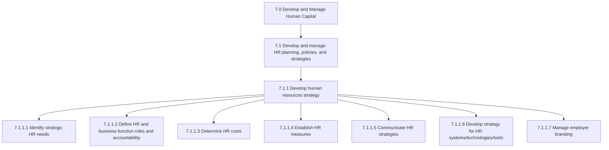
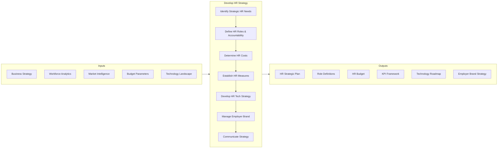
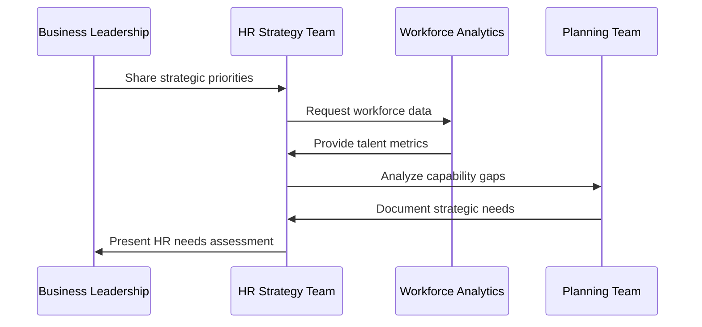
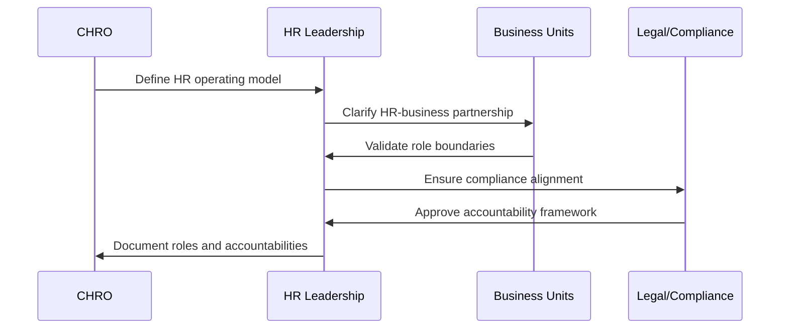
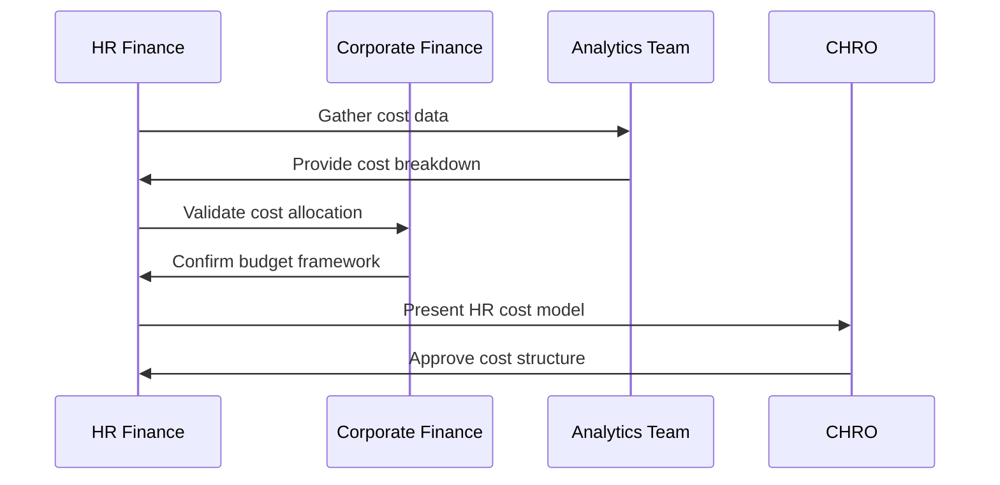
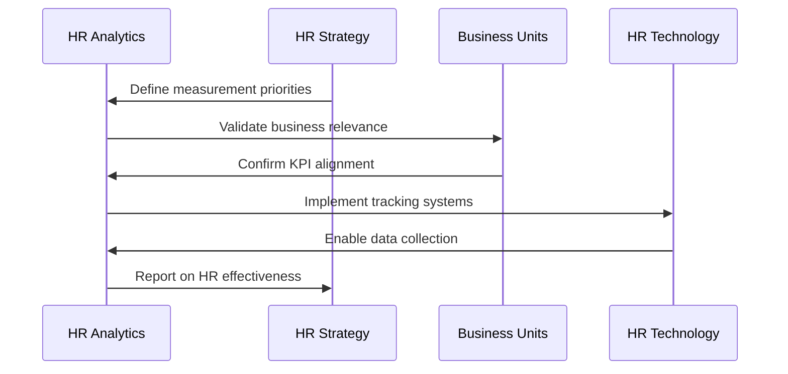
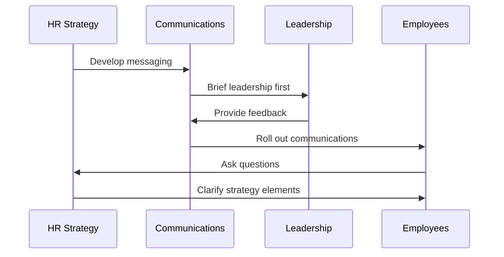
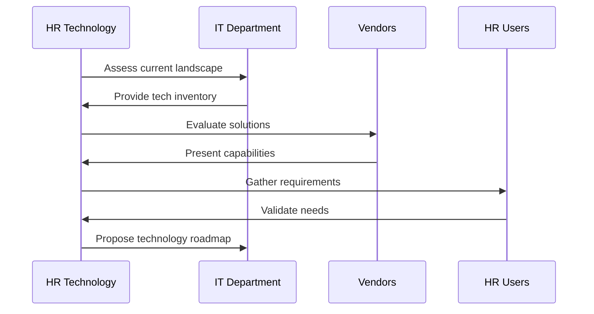
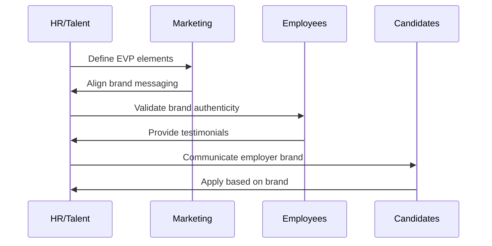
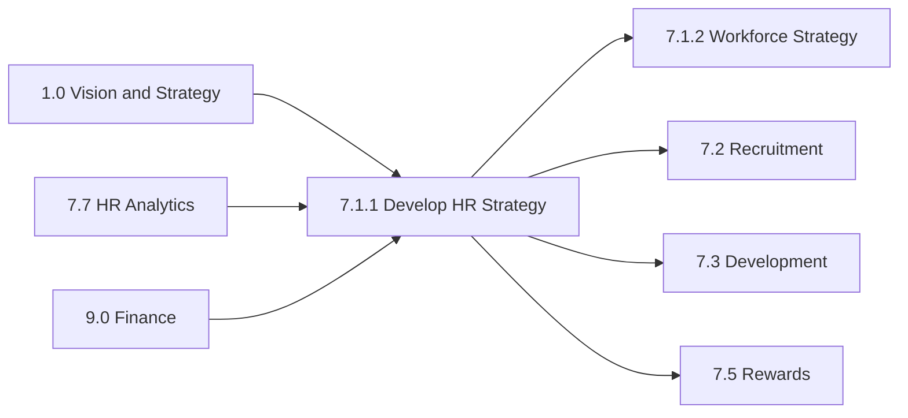

# Develop Human Resources Strategy

> Creating a long-term plan to associate human resource requirements with the strategic goals of the company to ensure that there is enough qualified staffing to achieve those goals, to maintain competitive advantage and to reduce employee turnover.

## Overview

Process 7.1.1 focuses on the strategic alignment of human resources with organizational objectives. This process translates business strategy into workforce requirements, defines HR's role in achieving organizational goals, and establishes the metrics and systems needed to measure HR effectiveness.

Strategic HR planning is foundational to organizational success. It ensures that talent acquisition, development, and retention efforts are purposefully directed toward achieving business objectives rather than operating as disconnected administrative functions.

## Process Hierarchy



## Key Statistics

| Metric | Value |
|--------|-------|
| APQC Code | 20958 |
| Hierarchy ID | 7.1.1 |
| Level | Process |
| Category | [Human Capital](/processes/07-HR) |
| Parent | [7.1 HR Planning, Policies, and Strategies](../) |
| Activities | 7 |

## Process Flow



## GraphDL Semantic Structure

```
develop.HumanResourcesStrategy
```

| Component | Value | Description |
|-----------|-------|-------------|
| Verb | `develop` | Creating and establishing |
| Object | `HumanResourcesStrategy` | Long-term HR plan |
| Preposition | - | N/A |
| PrepObject | - | N/A |

## Activities

### 7.1.1.1 - Identify Strategic HR Needs

Strategically defining the current and future needs for developing an efficient HR strategy.



**Tasks:**
- `analyze.BusinessStrategy` - Understand organizational direction
- `assess.CurrentWorkforce` - Evaluate existing capabilities
- `identify.CapabilityGaps` - Determine talent shortfalls
- `forecast.FutureNeeds` - Project workforce requirements

### 7.1.1.2 - Define HR and Business Function Roles and Accountability

Outlining the charge and duty of the HR function by defining its responsibility areas, as well as ensuring its accountability. Establish the HR function by laying out the roles and responsibilities for this function and the rules and regulations guiding HR.



**Tasks:**
- `define.HRMissionVision` - Establish HR purpose
- `establish.RolesResponsibilities` - Document HR functions
- `create.AccountabilityFramework` - Define metrics ownership
- `align.BusinessPartnership` - Clarify HR-business interfaces

### 7.1.1.3 - Determine HR Costs

Ascertaining the costs and expenses of the HR function. Identify and report HR investments using cost approach or present value of future earnings approach.



**Tasks:**
- `analyze.HRCostComponents` - Break down HR expenses
- `calculate.CostPerEmployee` - Determine per-capita costs
- `benchmark.IndustryCosts` - Compare to market rates
- `project.FutureInvestments` - Forecast HR spending needs

### 7.1.1.4 - Establish HR Measures

Evaluating the performance of HR function. Lay out the course of HR procedures that would formulate a plan of action needed to fulfill strategic HR needs.



**Tasks:**
- `define.KeyPerformanceIndicators` - Establish HR metrics
- `create.MeasurementDashboard` - Build reporting tools
- `align.MetricsToStrategy` - Link KPIs to objectives
- `establish.ReportingCadence` - Define review cycles

### 7.1.1.5 - Communicate HR Strategies

Conveying the strategies of HR function to employees and management. Effectively explain the vision, plans, and anticipated benefits of the HR strategy.



**Tasks:**
- `develop.CommunicationPlan` - Create messaging strategy
- `craft.KeyMessages` - Develop core content
- `execute.LeadershipBriefings` - Inform management
- `deploy.EmployeeCommunications` - Reach all staff

### 7.1.1.6 - Develop Strategy for HR Systems/Technologies/Tools

Creating a strategy for the use of systems/technologies/tools in operating the HR function. Decide what specific tools to use and in what quantity. Determine the levels of technology required for HR management.



**Tasks:**
- `assess.CurrentTechnologyLandscape` - Inventory existing tools
- `identify.TechnologyGaps` - Find capability shortfalls
- `evaluate.MarketSolutions` - Research vendor options
- `develop.TechnologyRoadmap` - Plan implementation path

### 7.1.1.7 - Manage Employer Branding

Creating, maintaining and communicating company's reputation and values to keep current employees and attract potential hires.



**Tasks:**
- `define.EmployerValueProposition` - Articulate unique offerings
- `develop.BrandAssets` - Create visual/content materials
- `manage.OnlinePresence` - Maintain career site, social
- `measure.BrandEffectiveness` - Track awareness and perception

## RACI Matrix

| Activity | Responsible | Accountable | Consulted | Informed |
|----------|-------------|-------------|-----------|----------|
| Identify strategic HR needs | HR Strategy | CHRO | Business leaders | All HR |
| Define HR roles | HR Leadership | CHRO | Legal, Finance | Managers |
| Determine HR costs | HR Finance | CHRO | CFO | Budget owners |
| Establish HR measures | HR Analytics | CHRO | Business units | All HR |
| Communicate strategies | HR Communications | CHRO | Marketing | All employees |
| Develop tech strategy | HR Technology | CHRO | CIO | HR users |
| Manage employer brand | Talent Acquisition | CHRO | Marketing | Candidates |

## Related Departments

- [Human Resources](/departments/HR) - Process owner and executor
- [Finance](/departments/Finance) - Cost management and budgeting
- [Information Technology](/departments/IT) - Technology strategy support
- [Marketing](/departments/Marketing) - Employer branding partnership
- [Legal](/departments/Legal) - Compliance review

## Related Occupations

- [Human Resources Managers](/occupations/HRManagers) - Strategy development leadership
- [Compensation and Benefits Managers](/occupations/CompBenefitsManagers) - Cost strategy input
- [Training and Development Managers](/occupations/TrainingManagers) - Capability planning
- [HR Information Systems Specialists](/occupations/HRISSpecialists) - Technology strategy

## Industry Variations

### Aerospace and Defense

Strategy development emphasizes cleared workforce planning, ITAR compliance, and multi-decade succession due to long program lifecycles.

**Industry-Specific Activities:**
- Develop cleared talent acquisition strategy
- Create ITAR-compliant workforce plans
- Build 20-30 year succession pipelines
- Establish security clearance processing strategy

### Banking

Regulatory compliance shapes strategy. Compensation governance, risk culture, and digital transformation skills dominate strategic priorities.

**Industry-Specific Activities:**
- Align HR strategy with OCC/Fed requirements
- Develop clawback and deferred compensation strategies
- Create risk culture reinforcement programs
- Build fintech talent acquisition strategy

### Healthcare Provider

Clinical workforce planning, provider burnout, and credentialing complexity require specialized strategic approaches.

**Industry-Specific Activities:**
- Develop clinical workforce forecasting models
- Create burnout prevention strategies
- Build credentialing process optimization plans
- Establish nursing pipeline programs

### Retail

High-turnover environments require robust hiring volume strategies and seasonal workforce planning.

**Industry-Specific Activities:**
- Create seasonal workforce ramp strategies
- Develop store-level staffing models
- Build high-volume hiring infrastructure
- Establish frontline retention programs

## Sub-Activities

| Activity | Code | Description |
|----------|------|-------------|
| [Identify Strategic HR Needs](./IdentifyStrategicHRNeeds.mdx) | 7.1.1.1 | Define current and future HR requirements |
| [Define HR Roles](./DefineHRRoles.mdx) | 7.1.1.2 | Establish HR function responsibilities |
| [Determine HR Costs](./DetermineHRCosts.mdx) | 7.1.1.3 | Calculate HR function expenses |
| [Establish HR Measures](./EstablishHRMeasures.mdx) | 7.1.1.4 | Define HR performance metrics |
| [Communicate HR Strategies](./CommunicateHRStrategies.mdx) | 7.1.1.5 | Share strategy with stakeholders |
| [Develop HR Tech Strategy](./DevelopHRTechStrategy.mdx) | 7.1.1.6 | Plan HR technology investments |
| [Manage Employer Branding](./ManageEmployerBranding.mdx) | 7.1.1.7 | Build employer reputation |

## Related Processes



## Metrics & KPIs

| Metric | Description | Target |
|--------|-------------|--------|
| Strategy Alignment Score | HR strategy alignment with business | >90% |
| HR Cost per Employee | Total HR cost / headcount | <$2,500 |
| HR ROI | Value delivered vs. cost invested | >300% |
| Employer Brand Ranking | Position in industry rankings | Top quartile |
| Technology Adoption Rate | Usage of HR systems | >85% |
| Strategy Communication Reach | Employees aware of HR strategy | >90% |

---

*Source: APQC PCF 20958 (7.1.1) - Cross-Industry*
