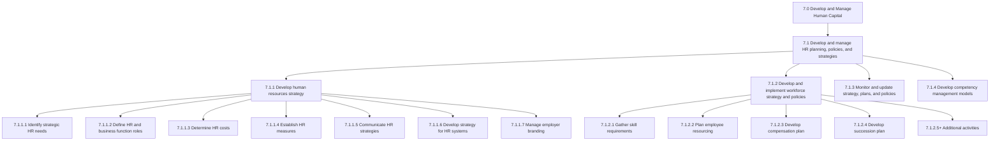
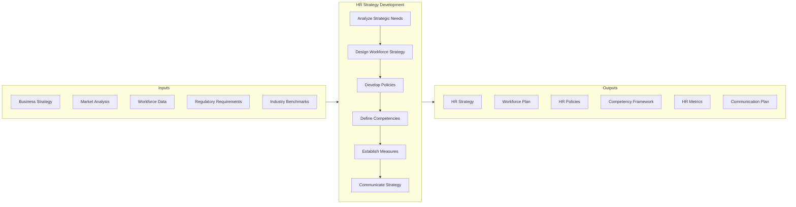

# Develop and Manage HR Planning, Policies, and Strategies

> Creating strategies for the HR function. Create and implement strategies for managing the work force. Supervise and enhance the strategies, plans, and policies supporting the HR function. Developing models for managing competency levels of the HR of the organization.

## Overview

Process Group 7.1 encompasses the strategic foundation of human capital management. This process group establishes the frameworks, policies, and strategies that guide all other HR activities across the organization. It translates business strategy into workforce requirements and creates the governance structure for HR service delivery.

Effective HR strategy development requires deep understanding of both organizational objectives and labor market dynamics. The processes in this group create alignment between workforce capabilities and business needs while establishing policies that ensure consistent, fair, and compliant HR practices.

## Process Hierarchy



## Key Statistics

| Metric | Value |
|--------|-------|
| APQC Code | 17043 |
| Hierarchy ID | 7.1 |
| Level | Process Group |
| Category | [Human Capital](/processes/07-HR) |
| Processes | 4 |
| Activities | 25+ |

## Process Flow



## GraphDL Semantic Structure

```
develop.HRPlanningPoliciesStrategies
manage.HRPlanningPoliciesStrategies
```

| Component | Value | Description |
|-----------|-------|-------------|
| Verb | `develop` | Creating new strategies and frameworks |
| Verb2 | `manage` | Ongoing administration and governance |
| Object | `HRPlanningPoliciesStrategies` | Strategic HR artifacts |

## Processes in this Group

### 7.1.1 - Develop Human Resources Strategy

Creating a long-term plan to associate human resource requirements with the strategic goals of the company to ensure that there is enough qualified staffing to achieve those goals, to maintain competitive advantage and to reduce employee turnover.

[View Process Details](./7.1.1-DevelopHRStrategy/)

### 7.1.2 - Develop and Implement Workforce Strategy and Policies

Creating and executing strategies and policies for smooth administration of work force. Determine and gather skill requirements. Plan the requirements for employee resourcing per unit.

[View Process Details](./7.1.2-WorkforceStrategy/)

### 7.1.3 - Monitor and Update Strategy, Plans, and Policies

Supervising the HR strategy, plans, and policies in order to refurbish them whenever needed. Determine the performance of HR plans and policies by measuring the objective achievement rate.

[View Process Details](./7.1.3-MonitorStrategy/)

### 7.1.4 - Develop Competency Management Models

Creating and implementing the tools for managing the competency levels of HR. Design a model for integrating HR planning with business planning.

[View Process Details](./7.1.4-CompetencyModels/)

## RACI Matrix

| Activity | Responsible | Accountable | Consulted | Informed |
|----------|-------------|-------------|-----------|----------|
| Develop HR strategy | HR Leadership | CHRO | CEO, CFO | All employees |
| Define HR costs | HR Finance | CHRO | Finance | Budget owners |
| Establish HR measures | HR Analytics | CHRO | Business units | Leadership |
| Workforce planning | HR Planning | CHRO | Department heads | Managers |
| Policy development | HR Policy Team | CHRO | Legal, Compliance | All employees |
| Competency modeling | L&D Team | CHRO | Business units | Employees |

## Related Departments

- [Human Resources](/departments/HR) - Primary strategy ownership
- [Finance](/departments/Finance) - Budget and cost management
- [Legal](/departments/Legal) - Policy compliance review
- [Executive Office](/departments/Executive) - Strategic alignment

## Related Occupations

- [Human Resources Managers](/occupations/HRManagers) - Strategy development
- [Compensation and Benefits Managers](/occupations/CompBenefitsManagers) - Compensation strategy
- [Training and Development Managers](/occupations/TrainingManagers) - Competency development
- [HR Business Partners](/occupations/HRBPs) - Strategy execution

## Industry Variations

### Aerospace and Defense

HR strategy emphasizes long-term workforce planning due to multi-decade program lifecycles. Security clearance requirements and ITAR compliance shape talent strategies.

**Industry-Specific Activities:**
- Develop cleared workforce pipeline strategy
- Create ITAR-compliant training frameworks
- Plan for engineering talent succession over decades
- Build relationships with cleared talent pools

### Banking and Financial Services

Regulatory compliance dominates HR strategy. Compensation practices are heavily regulated, and risk culture development is a strategic priority.

**Industry-Specific Activities:**
- Align HR strategy with regulatory requirements
- Develop compensation governance frameworks
- Create risk culture training strategies
- Plan for digital transformation talent needs

### Healthcare Provider

Clinical workforce planning, credentialing requirements, and burnout prevention shape HR strategy. Union relations require careful policy consideration.

**Industry-Specific Activities:**
- Develop clinical workforce planning models
- Create credentialing management strategies
- Build burnout prevention programs
- Manage union relationship strategies

### Retail

High-turnover environments require robust hiring strategies and labor scheduling optimization. Seasonal workforce planning is critical.

**Industry-Specific Activities:**
- Create high-volume seasonal hiring strategies
- Optimize labor scheduling policies
- Develop frontline retention programs
- Build part-time workforce engagement strategies

## Metrics & KPIs

| Metric | Description | Target |
|--------|-------------|--------|
| HR Strategy Alignment | Degree of alignment with business strategy | >90% |
| Policy Compliance Rate | Percentage of policies followed | >95% |
| Workforce Plan Accuracy | Forecast vs. actual staffing variance | <10% |
| HR Cost per Employee | Total HR spend divided by headcount | <$2,500 |
| Time to Policy Implementation | Days from approval to rollout | <30 days |
| Competency Model Coverage | Roles with defined competencies | >80% |

---

*Source: APQC PCF 17043 (7.1) - Cross-Industry*
