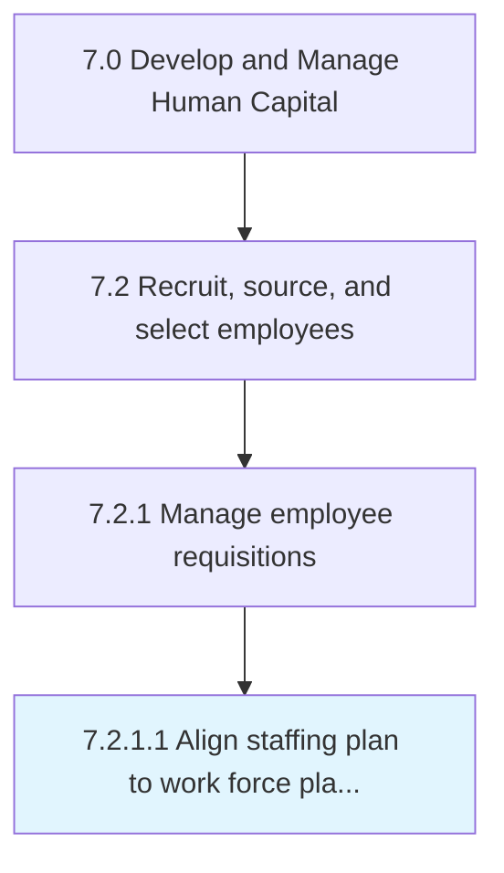

# Align staffing plan to work force plan and business unit strategies/resource needs

> Creating a correspondence between the plan for hiring new employees and the desired employee requirements.

## Overview

Activity 7.2.1.1 is an activity within the Develop and Manage Human Capital framework. 

Creating a correspondence between the plan for hiring new employees and the desired employee requirements. Staff an adequate amount of people with the appropriate skills to effectively accomplish its legislative, regulatory, service, and production requirements.

## Process Hierarchy



## Key Statistics

| Metric | Value |
|--------|-------|
| APQC Code | 10445 |
| Hierarchy ID | 7.2.1.1 |
| Level | Activity |
| Parent | [7.2.1](../) |
| Sub-Processes | 0 |


## GraphDL Semantic Structure

```
align.StaffingPlan.to.WorkForcePlanAndBusinessUnitStrategiesresourceNeeds
```

| Component | Value | Description |
|-----------|-------|-------------|
| Verb | `align` | Primary action |
| Object | `staffing plan` | Direct object |
| Preposition | `to` | Relationship |
| PrepObject | `work force plan and business unit strategies/resource needs` | Indirect object |


## Related Concepts

- [StaffingPlan](/concepts/StaffingPlan)
- [WorkForcePlanUnitStrategies/ResourceNeeds](/concepts/WorkForcePlanUnitStrategies/ResourceNeeds)
- [StaffingPlan](/concepts/StaffingPlan)
- [BusinessUnitStrategies/ResourceNeeds](/concepts/BusinessUnitStrategies/ResourceNeeds)


---

*Source: APQC PCF 10445 (7.2.1.1) - APQC*
