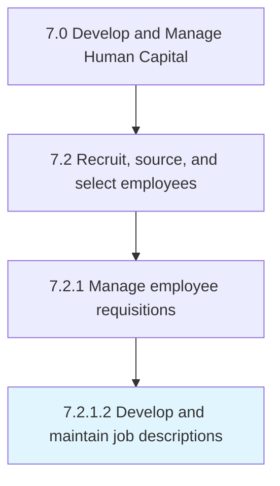

# Develop and maintain job descriptions

> Creating descriptions for job requisitions.

## Overview

Activity 7.2.1.2 is an activity within the Develop and Manage Human Capital framework. 

Creating descriptions for job requisitions. Define the normal components of a job description, such as the overall position description with general areas of responsibility listed, essential functions of the job described with a couple of examples of each, required knowledge, skills, abilities, required education and experience, a description of the physical demands, and a description of the work environment.

## Process Hierarchy



## Key Statistics

| Metric | Value |
|--------|-------|
| APQC Code | 10447 |
| Hierarchy ID | 7.2.1.2 |
| Level | Activity |
| Parent | [7.2.1](../) |
| Sub-Processes | 0 |


## GraphDL Semantic Structure

```
develop.AndMaintainJobDescriptions
```

| Component | Value | Description |
|-----------|-------|-------------|
| Verb | `develop` | Primary action |
| Object | `and maintain job descriptions` | Direct object |


## Related Concepts

- JobDescriptions
- JobDescriptions


---

*Source: APQC PCF 10447 (7.2.1.2) - APQC*
