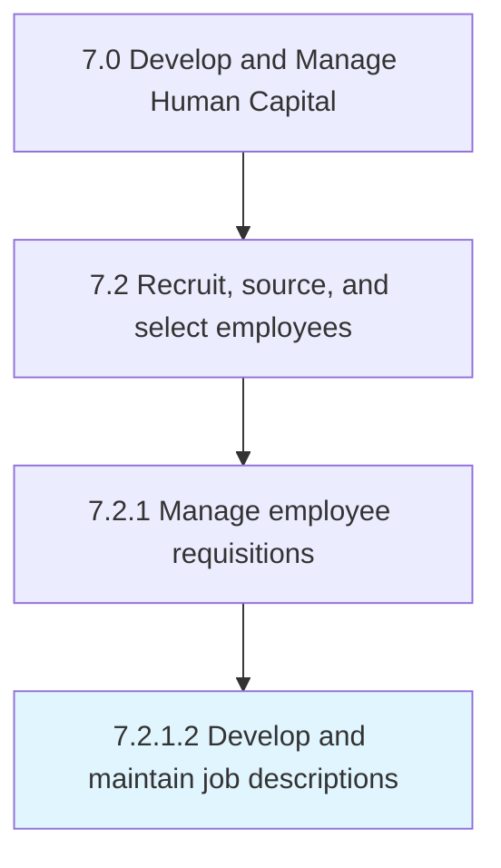
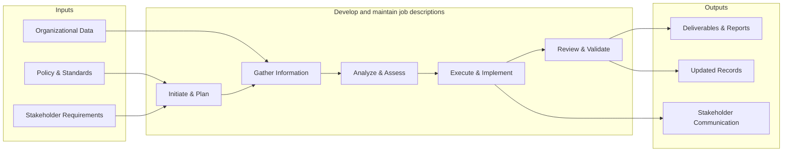

# Develop and maintain job descriptions

> Creating descriptions for job requisitions.

## Overview

Activity 7.2.1.2 is an activity within the Develop and Manage Human Capital framework. 

Creating descriptions for job requisitions. Define the normal components of a job description, such as the overall position description with general areas of responsibility listed, essential functions of the job described with a couple of examples of each, required knowledge, skills, abilities, required education and experience, a description of the physical demands, and a description of the work environment.

This process encompasses the end-to-end development of and maintain job descriptions, from initial needs assessment through design, implementation, and evaluation. It requires cross-functional collaboration, alignment with organizational objectives, and iterative refinement based on stakeholder feedback and performance metrics.

## Process Hierarchy



## Key Statistics

| Metric | Value |
|--------|-------|
| APQC Code | 10447 |
| Hierarchy ID | 7.2.1.2 |
| Level | Activity |
| Parent | [7.2.1](../) |
| Sub-Processes | 0 |


## GraphDL Semantic Structure

```graphdl
develop.AndMaintainJobDescriptions
```

| Component | Value | Description |
|-----------|-------|-------------|
| Verb | `develop` | Primary action |
| Object | `and maintain job descriptions` | Direct object |


## Related Concepts

- JobDescriptions
- JobDescriptions


## Process Flow



## RACI Matrix

| Activity | Responsible | Accountable | Consulted | Informed |
|----------|------------|-------------|-----------|----------|
| Create job requisition | Hiring Manager | Department Head | HR Business Partner | Recruiting Team |
| Screen candidates | Recruiter | Talent Acquisition Lead | Hiring Manager | HR Director |
| Extend job offer | Recruiter | Hiring Manager | Compensation Team | CHRO |

## Related Occupations

- [Human Resources Specialists](/occupations/Business/Operations/HumanResourcesSpecialists)
- [Human Resources Managers](/occupations/Management/HumanResourcesManagers)
- [Recruiting Coordinators](/occupations/Business/Operations/HumanResourcesSpecialists)
- [Training and Development Specialists](/occupations/Business/TrainingAndDevelopmentSpecialists)
- [Compensation and Benefits Managers](/occupations/Management/CompensationAndBenefitsManagers)

## Related Departments

- Human Resources
- Hiring Department
- Legal

## Industry Variations

### Healthcare

Requires credential verification, licensure validation, background checks for patient-facing roles, and compliance with Joint Commission standards.

### Technology

Emphasizes technical assessments, coding challenges, cultural fit interviews, and competitive offer packages with equity components.

### Retail

Focuses on high-volume seasonal hiring, part-time workforce management, quick turnaround screening, and multi-location coordination.

## KPIs & Metrics

| Metric | Description | Target |
|--------|-------------|--------|
| Time to Fill | Average days from requisition to accepted offer | < 45 days |
| Cost per Hire | Total recruitment cost divided by number of hires | < $4,500 |
| Quality of Hire | New hire performance rating after 12 months | > 3.5/5.0 |
| Offer Acceptance Rate | Percentage of offers accepted by candidates | > 85% |

---

*Source: APQC PCF 10447 (7.2.1.2) - APQC*
