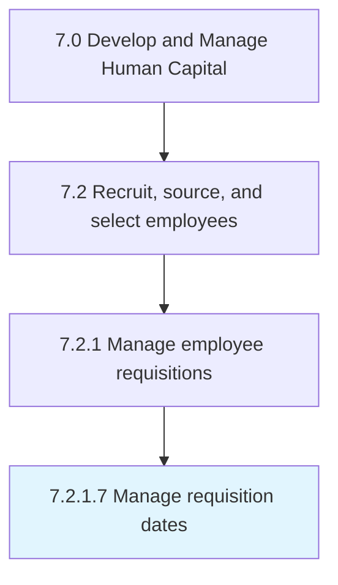

# Manage requisition dates

> Determining and managing the dates for the employee requisition process.

## Overview

Activity 7.2.1.7 is an activity within the Develop and Manage Human Capital framework. 

Determining and managing the dates for the employee requisition process.

## Process Hierarchy



## Key Statistics

| Metric | Value |
|--------|-------|
| APQC Code | 10452 |
| Hierarchy ID | 7.2.1.7 |
| Level | Activity |
| Parent | [7.2.1](../) |
| Sub-Processes | 0 |


## GraphDL Semantic Structure

```
manage.RequisitionDates
```

| Component | Value | Description |
|-----------|-------|-------------|
| Verb | `manage` | Primary action |
| Object | `requisition dates` | Direct object |


## Related Concepts

- RequisitionDates


---

*Source: APQC PCF 10452 (7.2.1.7) - APQC*
