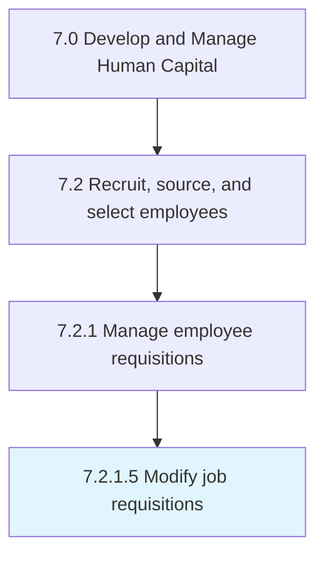

# Modify job requisitions

> Making the necessary alterations to job requisitions.

## Overview

Activity 7.2.1.5 is an activity within the Develop and Manage Human Capital framework. 

Making the necessary alterations to job requisitions. Revamp or revise the job requisitions in case a position is filled or is not vacant anymore, as well as in case of any new openings. (It involves Manage the internal/external job posting websites [10449] to make the necessary changes.)

## Process Hierarchy



## Key Statistics

| Metric | Value |
|--------|-------|
| APQC Code | 10450 |
| Hierarchy ID | 7.2.1.5 |
| Level | Activity |
| Parent | [7.2.1](../) |
| Sub-Processes | 0 |


## GraphDL Semantic Structure

```
modify.JobRequisitions
```

| Component | Value | Description |
|-----------|-------|-------------|
| Verb | `modify` | Primary action |
| Object | `job requisitions` | Direct object |


## Related Concepts

- JobRequisitions


---

*Source: APQC PCF 10450 (7.2.1.5) - APQC*
