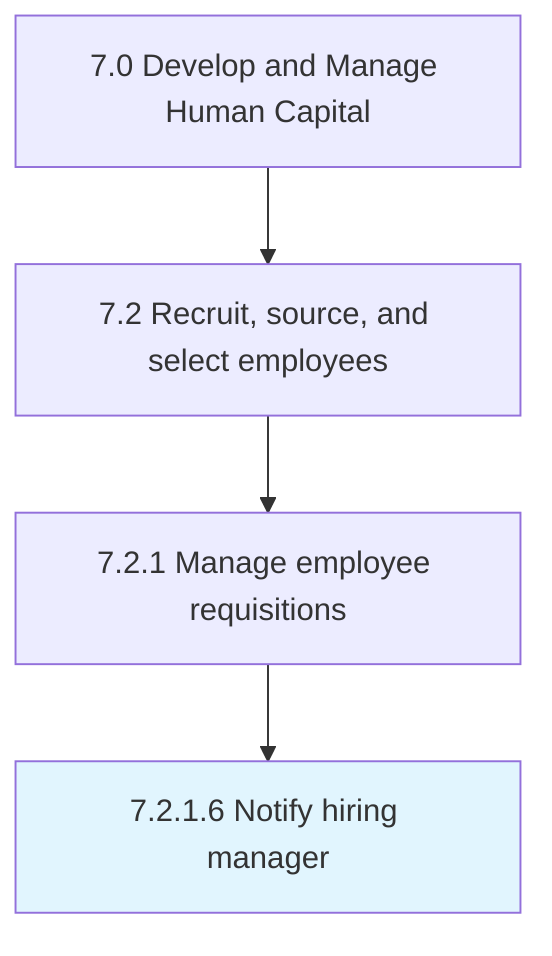

# Notify hiring manager

> Informing and communicating with the hiring manager.

## Overview

Activity 7.2.1.6 is an activity within the Develop and Manage Human Capital framework. 

Informing and communicating with the hiring manager. Notify the manager responsible for the hiring process in cases of any new position openings or changes.

## Process Hierarchy



## Key Statistics

| Metric | Value |
|--------|-------|
| APQC Code | 10451 |
| Hierarchy ID | 7.2.1.6 |
| Level | Activity |
| Parent | [7.2.1](../) |
| Sub-Processes | 0 |


## GraphDL Semantic Structure

```
notify.HiringManager
```

| Component | Value | Description |
|-----------|-------|-------------|
| Verb | `notify` | Primary action |
| Object | `hiring manager` | Direct object |


## Related Concepts

- [HiringManager](/concepts/HiringManager)


---

*Source: APQC PCF 10451 (7.2.1.6) - APQC*
