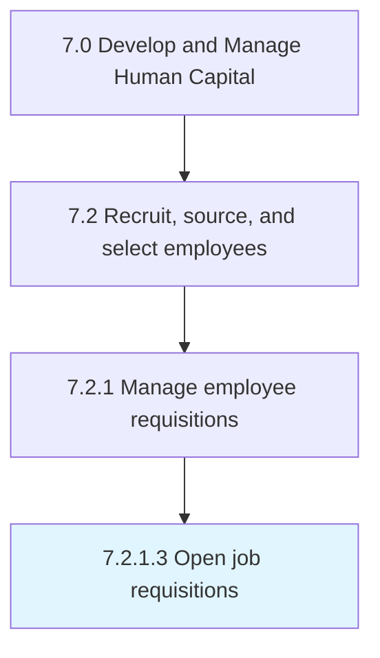

# Open job requisitions

> Developing specific job requisitions, and ensuring their accessibility.

## Overview

Activity 7.2.1.3 is an activity within the Develop and Manage Human Capital framework. 

Developing specific job requisitions, and ensuring their accessibility. Create and open a job requisition to fill the vacant positions within the organization. Clearly describe the job title, department, fill date, and the requisite skills and qualifications for the job.

## Process Hierarchy



## Key Statistics

| Metric | Value |
|--------|-------|
| APQC Code | 10446 |
| Hierarchy ID | 7.2.1.3 |
| Level | Activity |
| Parent | [7.2.1](../) |
| Sub-Processes | 0 |


## GraphDL Semantic Structure

```
open.JobRequisitions
```

| Component | Value | Description |
|-----------|-------|-------------|
| Verb | `open` | Primary action |
| Object | `job requisitions` | Direct object |


## Related Concepts

- JobRequisitions


---

*Source: APQC PCF 10446 (7.2.1.3) - APQC*
