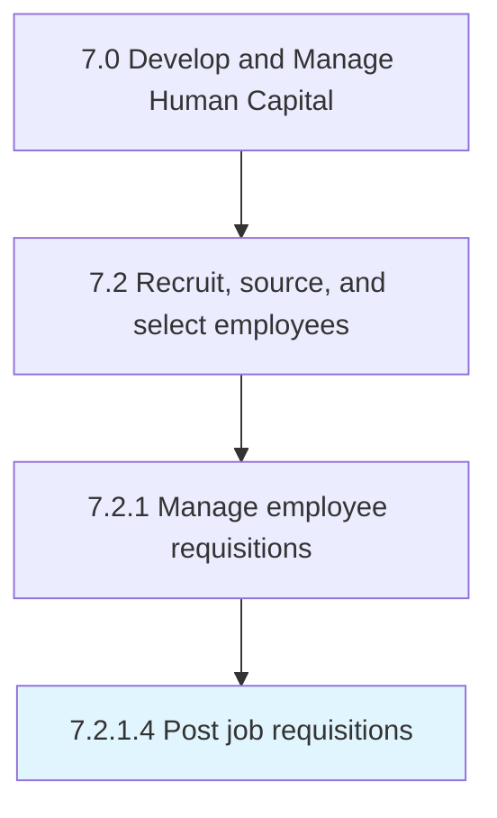
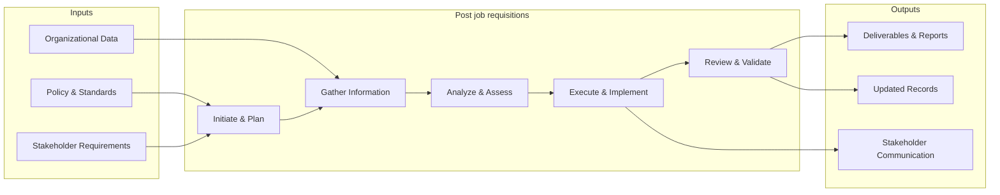
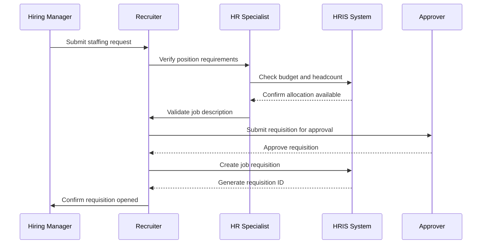

# Post job requisitions

> Posting and advertising job descriptions.

## Overview

Activity 7.2.1.4 is an activity within the Develop and Manage Human Capital framework. 

Posting and advertising job descriptions. Display open job descriptions internally and externally. Use public portals, online portals, and websites to upload these requisitions in order for applications to be received.

This process encompasses the systematic execution of activities related to job requisitions. It involves planning, coordination, execution, and evaluation to ensure outcomes align with organizational objectives and industry best practices. The process requires cross-functional collaboration and adherence to established policies and regulatory requirements.

## Process Hierarchy



## Key Statistics

| Metric | Value |
|--------|-------|
| APQC Code | 10448 |
| Hierarchy ID | 7.2.1.4 |
| Level | Activity |
| Parent | [7.2.1](../) |
| Sub-Processes | 0 |


## GraphDL Semantic Structure

```graphdl
post.JobRequisitions
```

| Component | Value | Description |
|-----------|-------|-------------|
| Verb | `post` | Primary action |
| Object | `job requisitions` | Direct object |


## Related Concepts

- JobRequisitions


## Process Flow



## Process Sequence



## RACI Matrix

| Activity | Responsible | Accountable | Consulted | Informed |
|----------|------------|-------------|-----------|----------|
| Create job requisition | Hiring Manager | Department Head | HR Business Partner | Recruiting Team |
| Screen candidates | Recruiter | Talent Acquisition Lead | Hiring Manager | HR Director |
| Extend job offer | Recruiter | Hiring Manager | Compensation Team | CHRO |

## Related Occupations

- [Human Resources Specialists](/occupations/Business/Operations/HumanResourcesSpecialists)
- [Human Resources Managers](/occupations/Management/HumanResourcesManagers)
- [Recruiting Coordinators](/occupations/Business/Operations/HumanResourcesSpecialists)
- [Training and Development Specialists](/occupations/Business/TrainingAndDevelopmentSpecialists)
- [Compensation and Benefits Managers](/occupations/Management/CompensationAndBenefitsManagers)

## Related Departments

- Human Resources
- Hiring Department
- Legal

## Industry Variations

### Healthcare

Requires credential verification, licensure validation, background checks for patient-facing roles, and compliance with Joint Commission standards.

### Technology

Emphasizes technical assessments, coding challenges, cultural fit interviews, and competitive offer packages with equity components.

### Retail

Focuses on high-volume seasonal hiring, part-time workforce management, quick turnaround screening, and multi-location coordination.

## KPIs & Metrics

| Metric | Description | Target |
|--------|-------------|--------|
| Time to Fill | Average days from requisition to accepted offer | < 45 days |
| Cost per Hire | Total recruitment cost divided by number of hires | < $4,500 |
| Quality of Hire | New hire performance rating after 12 months | > 3.5/5.0 |
| Offer Acceptance Rate | Percentage of offers accepted by candidates | > 85% |

---

*Source: APQC PCF 10448 (7.2.1.4) - APQC*
