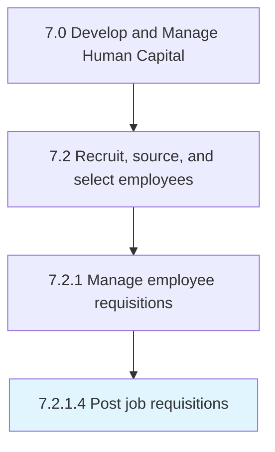

# Post job requisitions

> Posting and advertising job descriptions.

## Overview

Activity 7.2.1.4 is an activity within the Develop and Manage Human Capital framework. 

Posting and advertising job descriptions. Display open job descriptions internally and externally. Use public portals, online portals, and websites to upload these requisitions in order for applications to be received.

## Process Hierarchy



## Key Statistics

| Metric | Value |
|--------|-------|
| APQC Code | 10448 |
| Hierarchy ID | 7.2.1.4 |
| Level | Activity |
| Parent | [7.2.1](../) |
| Sub-Processes | 0 |


## GraphDL Semantic Structure

```
post.JobRequisitions
```

| Component | Value | Description |
|-----------|-------|-------------|
| Verb | `post` | Primary action |
| Object | `job requisitions` | Direct object |


## Related Concepts

- JobRequisitions


---

*Source: APQC PCF 10448 (7.2.1.4) - APQC*
