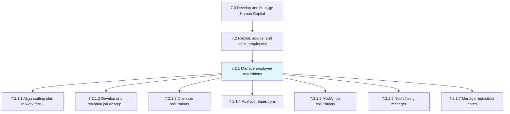
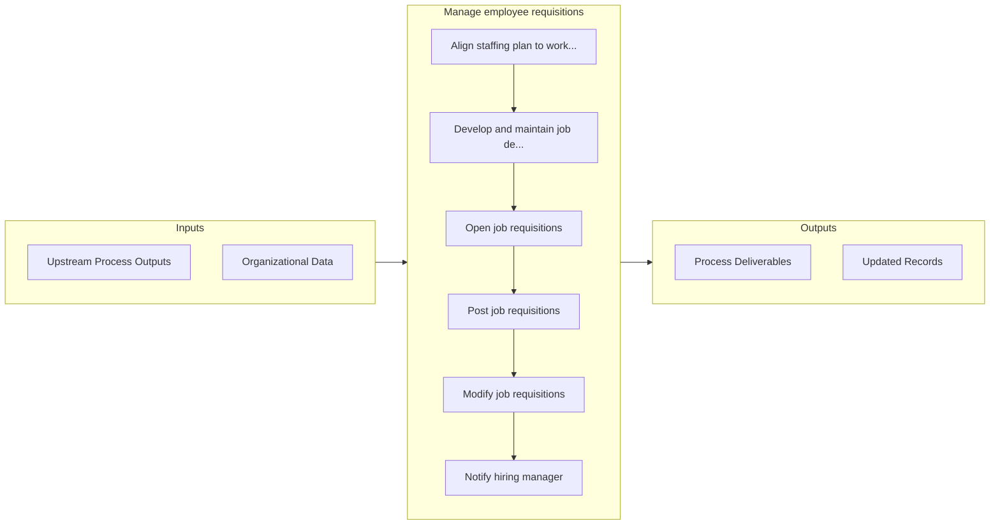

# Manage employee requisitions

> Handling the requirements for new employees.

## Overview

Process 7.2.1 is a core process that defines the specific procedures for manage employee requisitions. 

Handling the requirements for new employees. Create and open job requisitions by clearly defining the job descriptions. Post these requirements internally and externally, and modify them as appropriate. Manage the dates of the whole requisition process.

## Process Hierarchy



## Key Statistics

| Metric | Value |
|--------|-------|
| APQC Code | 10439 |
| Hierarchy ID | 7.2.1 |
| Level | Process |
| Parent | [7.2](../) |
| Sub-Processes | 7 |


## GraphDL Semantic Structure

```graphdl
manage.EmployeeRequisitions
```

| Component | Value | Description |
|-----------|-------|-------------|
| Verb | `manage` | Primary action |
| Object | `employee requisitions` | Direct object |


## Process Flow



## Sub-Processes

| Process | Hierarchy ID | Description |
|---------|-------------|-------------|
| [Align staffing plan to work force plan and business unit strategies/resource needs](./AlignStaffingPlanToWorkForcePlanAndBusinessUnitStrategiesresourceNeeds) | 7.2.1.1 | Creating a correspondence between the plan for hiring new employees and the desired employee require |
| [Develop and maintain job descriptions](./DevelopAndMaintainJobDescriptions) | 7.2.1.2 | Creating descriptions for job requisitions |
| [Open job requisitions](./OpenJobRequisitions) | 7.2.1.3 | Developing specific job requisitions, and ensuring their accessibility |
| [Post job requisitions](./PostJobRequisitions) | 7.2.1.4 | Posting and advertising job descriptions |
| [Modify job requisitions](./ModifyJobRequisitions) | 7.2.1.5 | Making the necessary alterations to job requisitions |
| [Notify hiring manager](./NotifyHiringManager) | 7.2.1.6 | Informing and communicating with the hiring manager |
| [Manage requisition dates](./ManageRequisitionDates) | 7.2.1.7 | Determining and managing the dates for the employee requisition process |


## Related Concepts

- EmployeeRequisitions


---

*Source: APQC PCF 10439 (7.2.1) - APQC*
