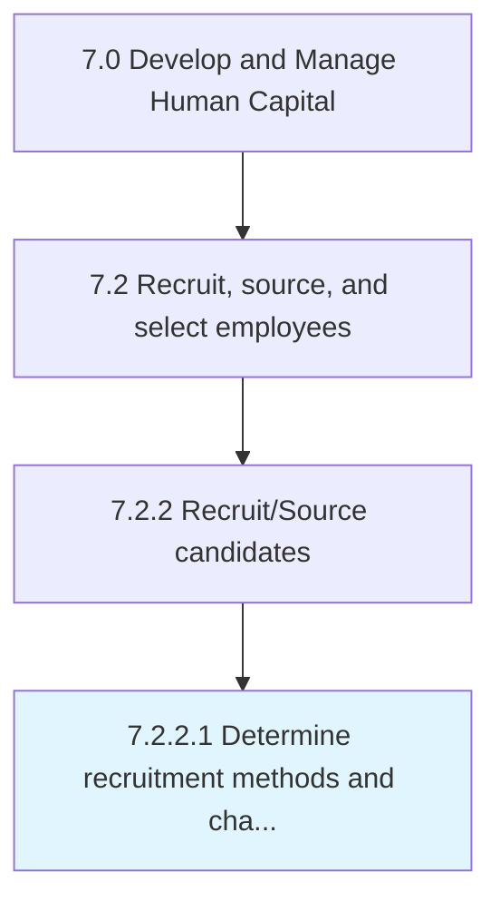

# Determine recruitment methods and channels

> Defining the methods and channels for recruitments in order to maximize the amount of candidate availability.

## Overview

Activity 7.2.2.1 is an activity within the Develop and Manage Human Capital framework. 

Defining the methods and channels for recruitments in order to maximize the amount of candidate availability. Use channels such as headhunting, job postings, job portals, networking websites, and media advertising. Choose from the various methods of recruitment such as internal/external third-party sourcing.

## Process Hierarchy



## Key Statistics

| Metric | Value |
|--------|-------|
| APQC Code | 10453 |
| Hierarchy ID | 7.2.2.1 |
| Level | Activity |
| Parent | [7.2.2](../) |
| Sub-Processes | 0 |


## GraphDL Semantic Structure

```
determine.RecruitmentMethodsAndChannels
```

| Component | Value | Description |
|-----------|-------|-------------|
| Verb | `determine` | Primary action |
| Object | `recruitment methods and channels` | Direct object |


## Related Concepts

- RecruitmentMethods
- Channels


---

*Source: APQC PCF 10453 (7.2.2.1) - APQC*
