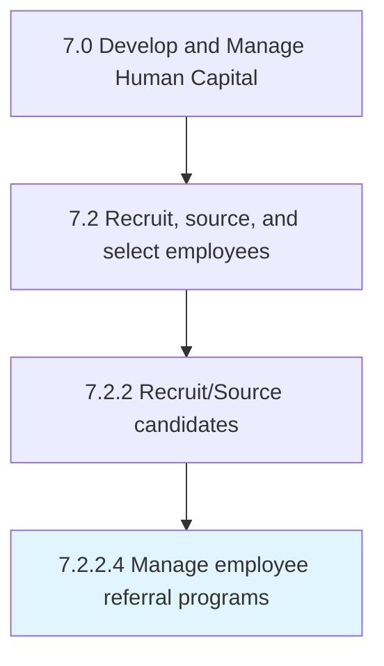

# Manage employee referral programs

> Creating and managing a recruiting strategy where current employees are rewarded for referring qualified candidates for employment.

## Overview

Activity 7.2.2.4 is an activity within the Develop and Manage Human Capital framework. 

Creating and managing a recruiting strategy where current employees are rewarded for referring qualified candidates for employment.

## Process Hierarchy



## Key Statistics

| Metric | Value |
|--------|-------|
| APQC Code | 17047 |
| Hierarchy ID | 7.2.2.4 |
| Level | Activity |
| Parent | [7.2.2](../) |
| Sub-Processes | 0 |


## GraphDL Semantic Structure

```
manage.EmployeeReferralPrograms
```

| Component | Value | Description |
|-----------|-------|-------------|
| Verb | `manage` | Primary action |
| Object | `employee referral programs` | Direct object |


## Related Concepts

- EmployeeReferralPrograms


---

*Source: APQC PCF 17047 (7.2.2.4) - APQC*
