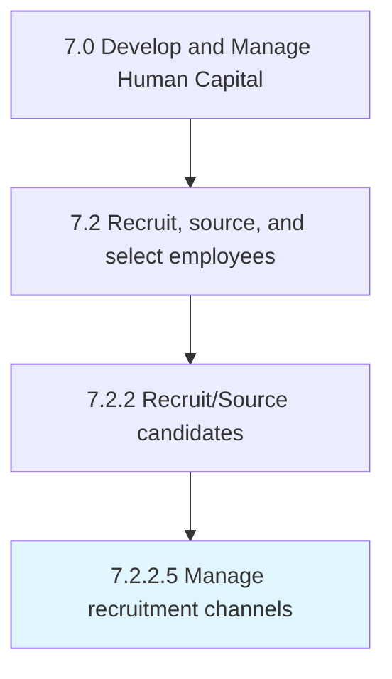

# Manage recruitment channels

> Establishing and maintaining channels for recruiting.

## Overview

Activity 7.2.2.5 is an activity within the Develop and Manage Human Capital framework. 

Establishing and maintaining channels for recruiting. Extract the best out of every recruitment channel. Manage all the processes related to all the sourcing channels.

## Process Hierarchy



## Key Statistics

| Metric | Value |
|--------|-------|
| APQC Code | 17048 |
| Hierarchy ID | 7.2.2.5 |
| Level | Activity |
| Parent | [7.2.2](../) |
| Sub-Processes | 0 |


## GraphDL Semantic Structure

```
manage.RecruitmentChannels
```

| Component | Value | Description |
|-----------|-------|-------------|
| Verb | `manage` | Primary action |
| Object | `recruitment channels` | Direct object |


## Related Concepts

- RecruitmentChannels


---

*Source: APQC PCF 17048 (7.2.2.5) - APQC*
