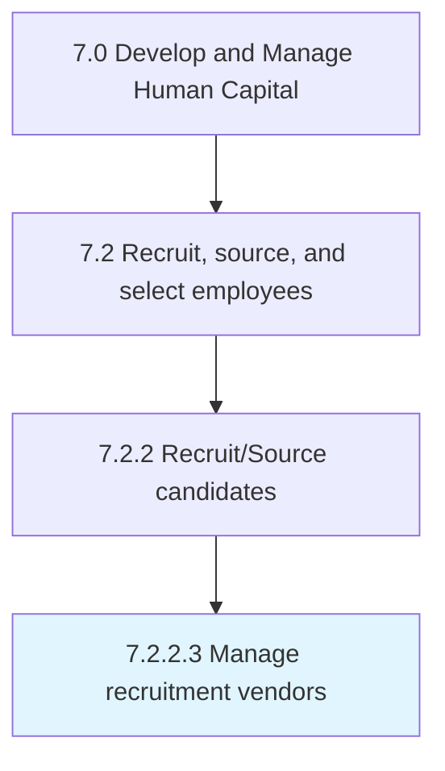
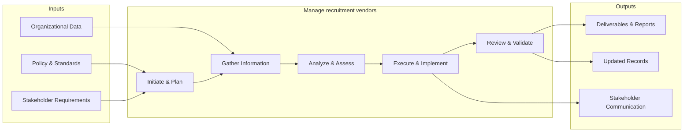
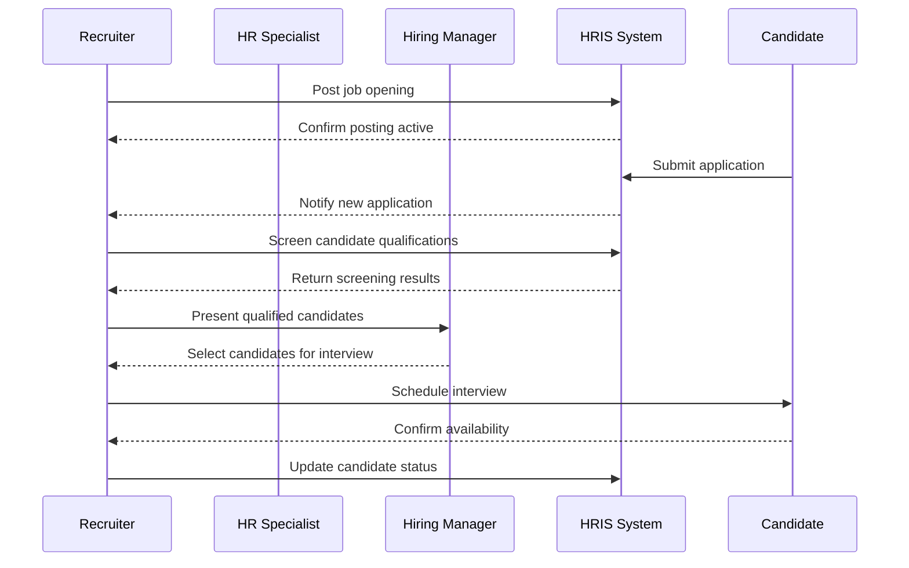

# Manage recruitment vendors

> Establishing and maintaining relationships with recruitment vendors (suppliers).

## Overview

Activity 7.2.2.3 is an activity within the Develop and Manage Human Capital framework. 

Establishing and maintaining relationships with recruitment vendors (suppliers). Create and maintain relationships with third-party agencies such as staffing and firms to expand. Use these relationships to implement the sourcing process effectively.

This process provides a structured approach to managing recruitment vendors across the organization. It includes establishing governance frameworks, defining operational procedures, monitoring performance, ensuring compliance with policies and regulations, and driving continuous improvement through data-driven insights.

## Process Hierarchy



## Key Statistics

| Metric | Value |
|--------|-------|
| APQC Code | 10455 |
| Hierarchy ID | 7.2.2.3 |
| Level | Activity |
| Parent | [7.2.2](../) |
| Sub-Processes | 0 |


## GraphDL Semantic Structure

```graphdl
manage.RecruitmentVendors
```

| Component | Value | Description |
|-----------|-------|-------------|
| Verb | `manage` | Primary action |
| Object | `recruitment vendors` | Direct object |


## Related Concepts

- RecruitmentVendors


## Process Flow



## Process Sequence



## RACI Matrix

| Activity | Responsible | Accountable | Consulted | Informed |
|----------|------------|-------------|-----------|----------|
| Create job requisition | Hiring Manager | Department Head | HR Business Partner | Recruiting Team |
| Screen candidates | Recruiter | Talent Acquisition Lead | Hiring Manager | HR Director |
| Extend job offer | Recruiter | Hiring Manager | Compensation Team | CHRO |

## Related Occupations

- [Human Resources Specialists](/occupations/Business/Operations/HumanResourcesSpecialists)
- [Human Resources Managers](/occupations/Management/HumanResourcesManagers)
- [Recruiting Coordinators](/occupations/Business/Operations/HumanResourcesSpecialists)
- [Training and Development Specialists](/occupations/Business/TrainingAndDevelopmentSpecialists)
- [Compensation and Benefits Managers](/occupations/Management/CompensationAndBenefitsManagers)

## Related Departments

- Human Resources
- Hiring Department
- Legal

## Industry Variations

### Healthcare

Requires credential verification, licensure validation, background checks for patient-facing roles, and compliance with Joint Commission standards.

### Technology

Emphasizes technical assessments, coding challenges, cultural fit interviews, and competitive offer packages with equity components.

### Retail

Focuses on high-volume seasonal hiring, part-time workforce management, quick turnaround screening, and multi-location coordination.

## KPIs & Metrics

| Metric | Description | Target |
|--------|-------------|--------|
| Time to Fill | Average days from requisition to accepted offer | < 45 days |
| Cost per Hire | Total recruitment cost divided by number of hires | < $4,500 |
| Quality of Hire | New hire performance rating after 12 months | > 3.5/5.0 |
| Offer Acceptance Rate | Percentage of offers accepted by candidates | > 85% |

---

*Source: APQC PCF 10455 (7.2.2.3) - APQC*
