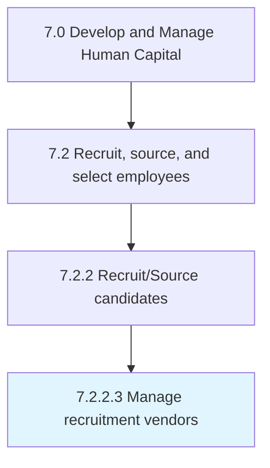

# Manage recruitment vendors

> Establishing and maintaining relationships with recruitment vendors (suppliers).

## Overview

Activity 7.2.2.3 is an activity within the Develop and Manage Human Capital framework. 

Establishing and maintaining relationships with recruitment vendors (suppliers). Create and maintain relationships with third-party agencies such as staffing and firms to expand. Use these relationships to implement the sourcing process effectively.

## Process Hierarchy



## Key Statistics

| Metric | Value |
|--------|-------|
| APQC Code | 10455 |
| Hierarchy ID | 7.2.2.3 |
| Level | Activity |
| Parent | [7.2.2](../) |
| Sub-Processes | 0 |


## GraphDL Semantic Structure

```
manage.RecruitmentVendors
```

| Component | Value | Description |
|-----------|-------|-------------|
| Verb | `manage` | Primary action |
| Object | `recruitment vendors` | Direct object |


## Related Concepts

- RecruitmentVendors


---

*Source: APQC PCF 10455 (7.2.2.3) - APQC*
