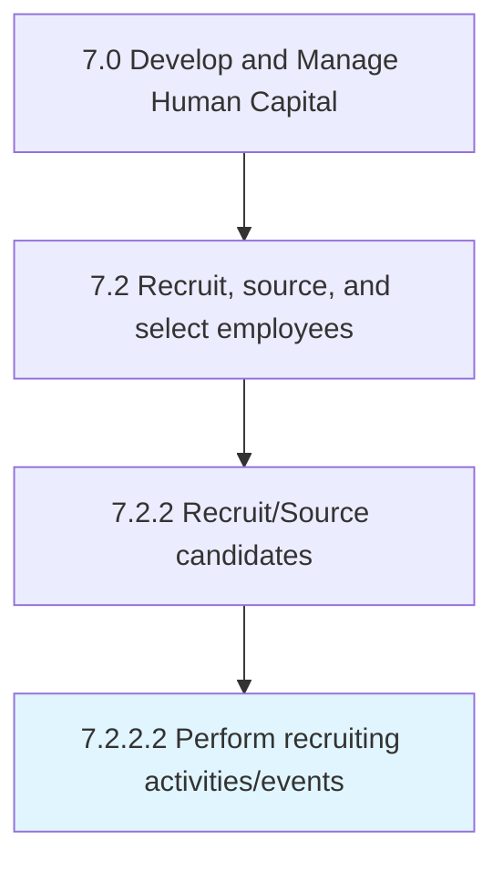

# Perform recruiting activities/events

> Organizing and executing recruiting activities and events.

## Overview

Activity 7.2.2.2 is an activity within the Develop and Manage Human Capital framework. 

Organizing and executing recruiting activities and events. Activities and events include on-campus hiring, refresher courses, information sessions, career fairs, etc. to increase the coverage of the sourcing in order to ensure that the most deserving and appropriate candidates are hired.

## Process Hierarchy



## Key Statistics

| Metric | Value |
|--------|-------|
| APQC Code | 10454 |
| Hierarchy ID | 7.2.2.2 |
| Level | Activity |
| Parent | [7.2.2](../) |
| Sub-Processes | 0 |


## GraphDL Semantic Structure

```
perform.RecruitingActivitiesevents
```

| Component | Value | Description |
|-----------|-------|-------------|
| Verb | `perform` | Primary action |
| Object | `recruiting activities/events` | Direct object |


## Related Concepts

- [RecruitingActivities](/concepts/RecruitingActivities)
- [RecruitingEvents](/concepts/RecruitingEvents)


---

*Source: APQC PCF 10454 (7.2.2.2) - APQC*
