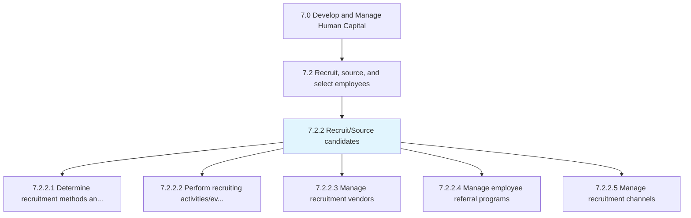
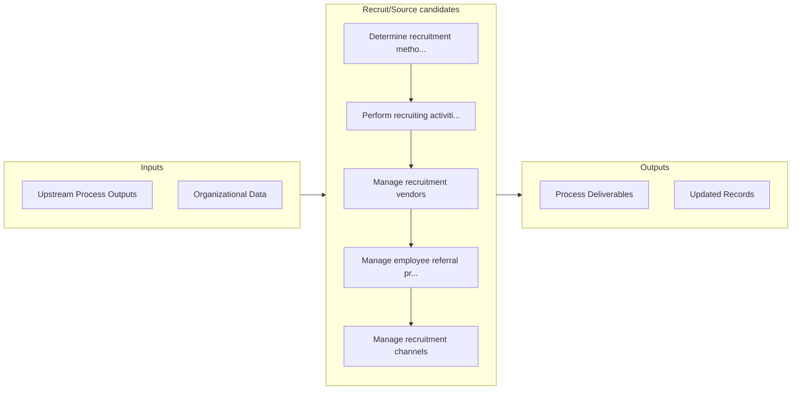

# Recruit/Source candidates

> Recruiting new candidates for deployment across various functional areas inside the organization.

## Overview

Process 7.2.2 is a core process that defines the specific procedures for recruit/source candidates. 

Recruiting new candidates for deployment across various functional areas inside the organization. Select methods for sourcing new employees. Manage relationships with third-party agencies. Stage recruitment fairs and drives. Manage employee referral programs.

## Process Hierarchy



## Key Statistics

| Metric | Value |
|--------|-------|
| APQC Code | 10440 |
| Hierarchy ID | 7.2.2 |
| Level | Process |
| Parent | [7.2](../) |
| Sub-Processes | 5 |


## GraphDL Semantic Structure

```graphdl
recruit/source.Candidates
```

| Component | Value | Description |
|-----------|-------|-------------|
| Verb | `recruit/source` | Primary action |
| Object | `candidates` | Direct object |


## Process Flow



## Sub-Processes

| Process | Hierarchy ID | Description |
|---------|-------------|-------------|
| [Determine recruitment methods and channels](./DetermineRecruitmentMethodsAndChannels) | 7.2.2.1 | Defining the methods and channels for recruitments in order to maximize the amount of candidate avai |
| [Perform recruiting activities/events](./PerformRecruitingActivitiesevents) | 7.2.2.2 | Organizing and executing recruiting activities and events |
| [Manage recruitment vendors](./ManageRecruitmentVendors) | 7.2.2.3 | Establishing and maintaining relationships with recruitment vendors (suppliers) |
| [Manage employee referral programs](./ManageEmployeeReferralPrograms) | 7.2.2.4 | Creating and managing a recruiting strategy where current employees are rewarded for referring quali |
| [Manage recruitment channels](./ManageRecruitmentChannels) | 7.2.2.5 | Establishing and maintaining channels for recruiting |


## Related Concepts

- Candidates
- Candidates


---

*Source: APQC PCF 10440 (7.2.2) - APQC*
