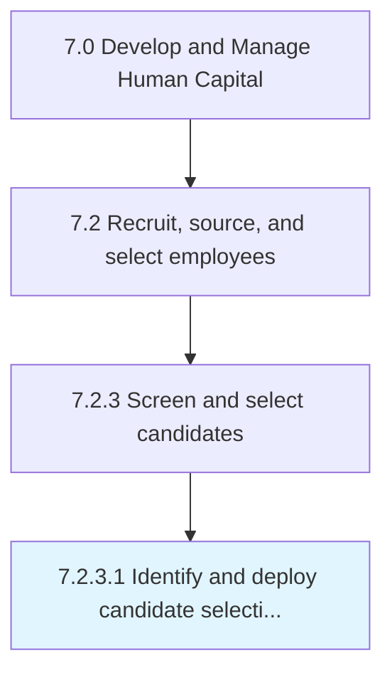

# Identify and deploy candidate selection tools

> Identifying and implementing tools for the selection of candidates.

## Overview

Activity 7.2.3.1 is an activity within the Develop and Manage Human Capital framework. 

Identifying and implementing tools for the selection of candidates. Recognize candidate selection tools such as screening, telephone interviews, hiring manager interviews, drug testing, and skills assessment. Effectively deploy these tools to check if the candidates fit in the workplace or not, as well as to ensure workplace safety.

## Process Hierarchy



## Key Statistics

| Metric | Value |
|--------|-------|
| APQC Code | 10456 |
| Hierarchy ID | 7.2.3.1 |
| Level | Activity |
| Parent | [7.2.3](../) |
| Sub-Processes | 0 |


## GraphDL Semantic Structure

```
identify.AndDeployCandidateSelectionTools
```

| Component | Value | Description |
|-----------|-------|-------------|
| Verb | `identify` | Primary action |
| Object | `and deploy candidate selection tools` | Direct object |


## Related Concepts

- [CandidateSelectionTools](/concepts/CandidateSelectionTools)
- [CandidateSelectionTools](/concepts/CandidateSelectionTools)


---

*Source: APQC PCF 10456 (7.2.3.1) - APQC*
