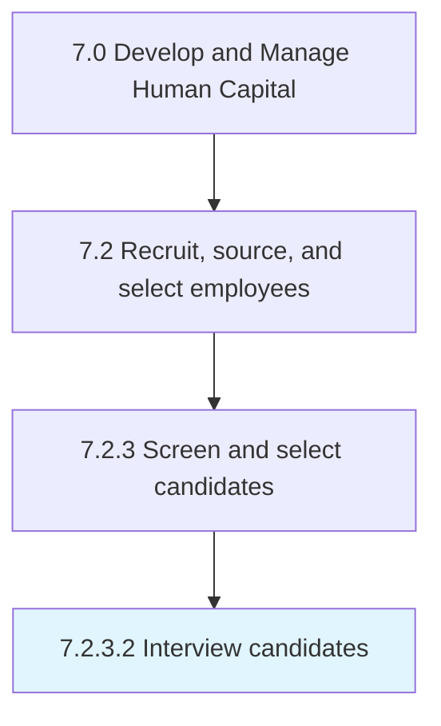

# Interview candidates

> Assessing the candidates by their performance in the interviews.

## Overview

Activity 7.2.3.2 is an activity within the Develop and Manage Human Capital framework. 

Assessing the candidates by their performance in the interviews. Conduct HR interview, technical interview, hiring manager interview, etc. Understand the mindset of the candidate, and comprehend his/her personal and professional lives.

## Process Hierarchy



## Key Statistics

| Metric | Value |
|--------|-------|
| APQC Code | 10457 |
| Hierarchy ID | 7.2.3.2 |
| Level | Activity |
| Parent | [7.2.3](../) |
| Sub-Processes | 0 |


## GraphDL Semantic Structure

```
interview.Candidates
```

| Component | Value | Description |
|-----------|-------|-------------|
| Verb | `interview` | Primary action |
| Object | `candidates` | Direct object |


## Related Concepts

- [Candidates](/concepts/Candidates)


---

*Source: APQC PCF 10457 (7.2.3.2) - APQC*
