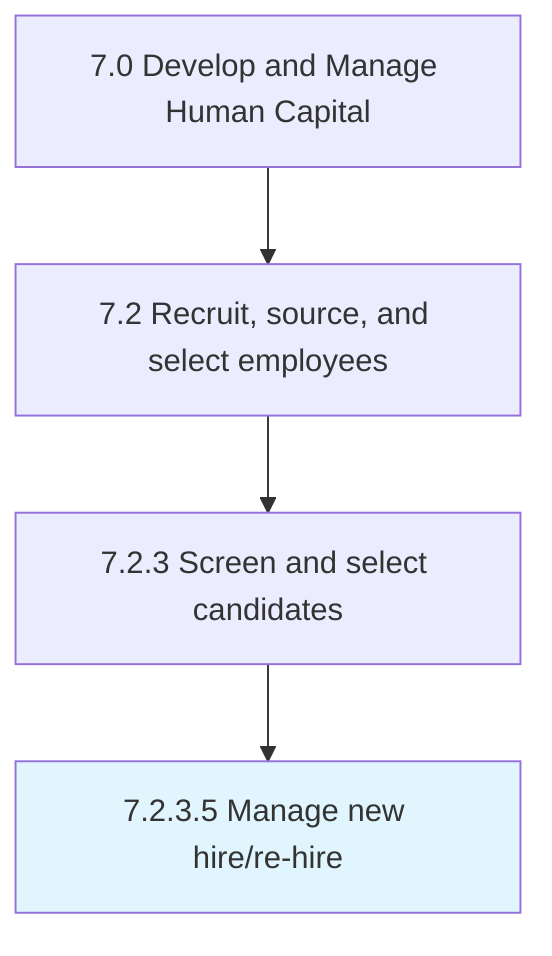

# Manage new hire/re-hire

> Creating and making job offers to the selected candidates.

## Overview

Activity 7.2.3.5 is an activity within the Develop and Manage Human Capital framework. 

Creating and making job offers to the selected candidates. Fairly negotiate the job offers. Agree on terms with the candidate to complete the hiring process.

## Process Hierarchy



## Key Statistics

| Metric | Value |
|--------|-------|
| APQC Code | 10443 |
| Hierarchy ID | 7.2.3.5 |
| Level | Activity |
| Parent | [7.2.3](../) |
| Sub-Processes | 0 |


## GraphDL Semantic Structure

```
manage.NewHirerehire
```

| Component | Value | Description |
|-----------|-------|-------------|
| Verb | `manage` | Primary action |
| Object | `new hire/re-hire` | Direct object |


---

*Source: APQC PCF 10443 (7.2.3.5) - APQC*
