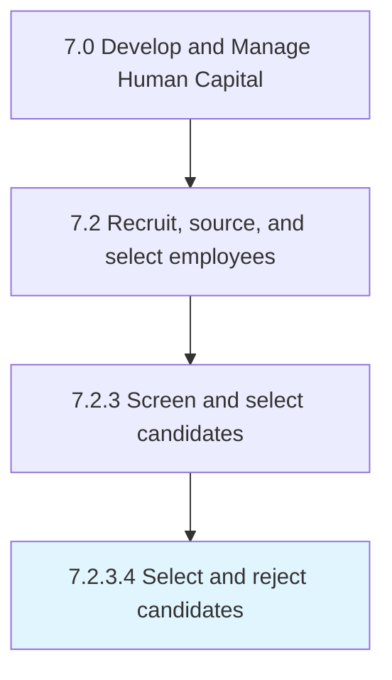

# Select and reject candidates

> Approving the deserving candidates, and rejecting the others.

## Overview

Activity 7.2.3.4 is an activity within the Develop and Manage Human Capital framework. 

Approving the deserving candidates, and rejecting the others. Examining the performance of candidates. Ensure candidates would fit well with the organization. (Assess performance from Interview candidates [10457] and Test candidates [10458].)

## Process Hierarchy



## Key Statistics

| Metric | Value |
|--------|-------|
| APQC Code | 10459 |
| Hierarchy ID | 7.2.3.4 |
| Level | Activity |
| Parent | [7.2.3](../) |
| Sub-Processes | 0 |


## GraphDL Semantic Structure

```
select.AndRejectCandidates
```

| Component | Value | Description |
|-----------|-------|-------------|
| Verb | `select` | Primary action |
| Object | `and reject candidates` | Direct object |


## Related Concepts

- [Candidates](/concepts/Candidates)
- [Candidates](/concepts/Candidates)


---

*Source: APQC PCF 10459 (7.2.3.4) - APQC*
