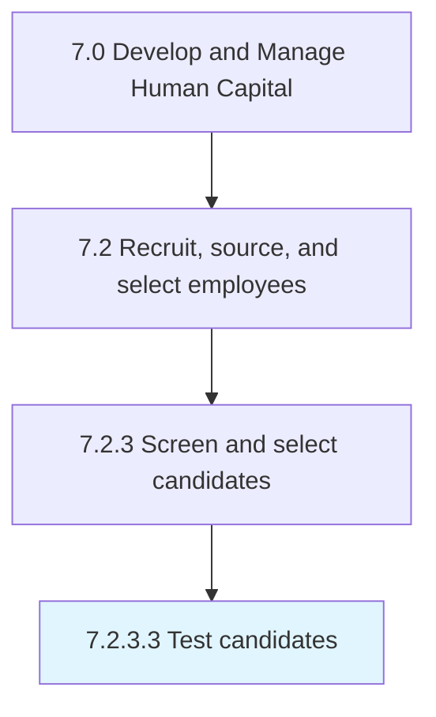

# Test candidates

> Examining the candidates through tests.

## Overview

Activity 7.2.3.3 is an activity within the Develop and Manage Human Capital framework. 

Examining the candidates through tests. Prepare tools such as aptitude, technical, and grammar tests. Test the skills of the candidate through a written, oral, or computerized test.

## Process Hierarchy



## Key Statistics

| Metric | Value |
|--------|-------|
| APQC Code | 10458 |
| Hierarchy ID | 7.2.3.3 |
| Level | Activity |
| Parent | [7.2.3](../) |
| Sub-Processes | 0 |


## GraphDL Semantic Structure

```
test.Candidates
```

| Component | Value | Description |
|-----------|-------|-------------|
| Verb | `test` | Primary action |
| Object | `candidates` | Direct object |


## Related Concepts

- Candidates


---

*Source: APQC PCF 10458 (7.2.3.3) - APQC*
