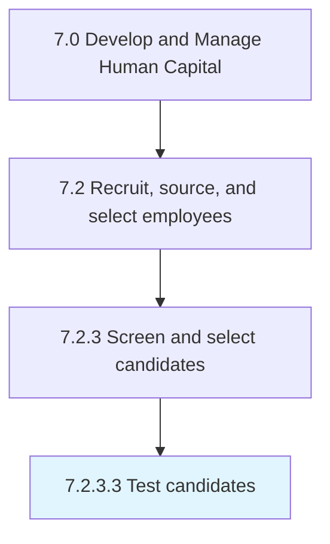
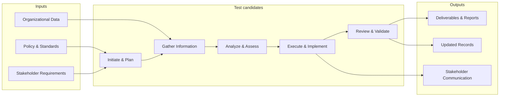
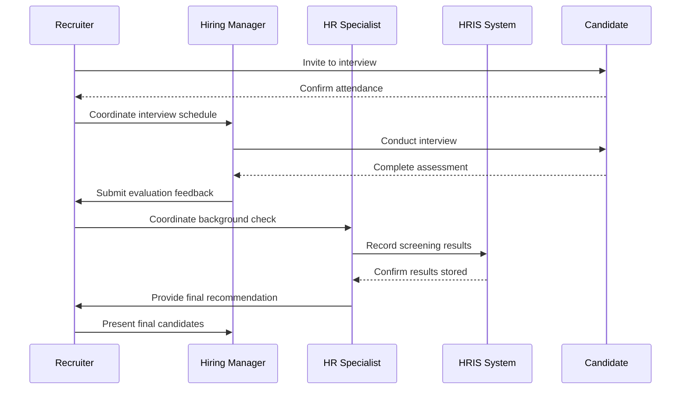

# Test candidates

> Examining the candidates through tests.

## Overview

Activity 7.2.3.3 is an activity within the Develop and Manage Human Capital framework. 

Examining the candidates through tests. Prepare tools such as aptitude, technical, and grammar tests. Test the skills of the candidate through a written, oral, or computerized test.

This process designs and executes testing procedures for candidates. It involves developing test criteria, administering assessments, scoring and analyzing results, ensuring validity and reliability, and reporting outcomes to decision-makers.

## Process Hierarchy



## Key Statistics

| Metric | Value |
|--------|-------|
| APQC Code | 10458 |
| Hierarchy ID | 7.2.3.3 |
| Level | Activity |
| Parent | [7.2.3](../) |
| Sub-Processes | 0 |


## GraphDL Semantic Structure

```graphdl
test.Candidates
```

| Component | Value | Description |
|-----------|-------|-------------|
| Verb | `test` | Primary action |
| Object | `candidates` | Direct object |


## Related Concepts

- Candidates


## Process Flow



## Process Sequence



## RACI Matrix

| Activity | Responsible | Accountable | Consulted | Informed |
|----------|------------|-------------|-----------|----------|
| Create job requisition | Hiring Manager | Department Head | HR Business Partner | Recruiting Team |
| Screen candidates | Recruiter | Talent Acquisition Lead | Hiring Manager | HR Director |
| Extend job offer | Recruiter | Hiring Manager | Compensation Team | CHRO |

## Related Occupations

- [Human Resources Specialists](/occupations/Business/Operations/HumanResourcesSpecialists)
- [Human Resources Managers](/occupations/Management/HumanResourcesManagers)
- [Recruiting Coordinators](/occupations/Business/Operations/HumanResourcesSpecialists)
- [Training and Development Specialists](/occupations/Business/TrainingAndDevelopmentSpecialists)
- [Compensation and Benefits Managers](/occupations/Management/CompensationAndBenefitsManagers)

## Related Departments

- Human Resources
- Hiring Department
- Legal

## Industry Variations

### Healthcare

Requires credential verification, licensure validation, background checks for patient-facing roles, and compliance with Joint Commission standards.

### Technology

Emphasizes technical assessments, coding challenges, cultural fit interviews, and competitive offer packages with equity components.

### Retail

Focuses on high-volume seasonal hiring, part-time workforce management, quick turnaround screening, and multi-location coordination.

## KPIs & Metrics

| Metric | Description | Target |
|--------|-------------|--------|
| Time to Fill | Average days from requisition to accepted offer | < 45 days |
| Cost per Hire | Total recruitment cost divided by number of hires | < $4,500 |
| Quality of Hire | New hire performance rating after 12 months | > 3.5/5.0 |
| Offer Acceptance Rate | Percentage of offers accepted by candidates | > 85% |

---

*Source: APQC PCF 10458 (7.2.3.3) - APQC*
