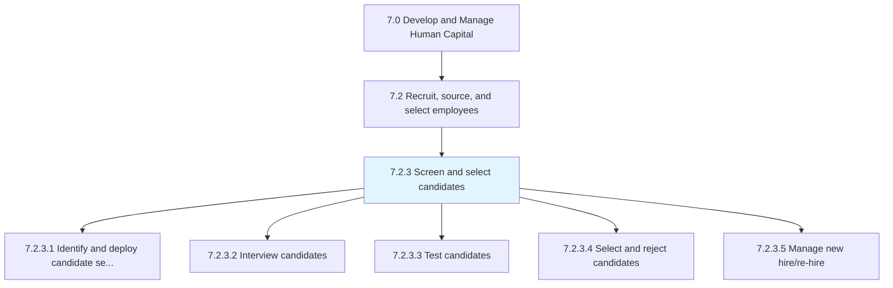
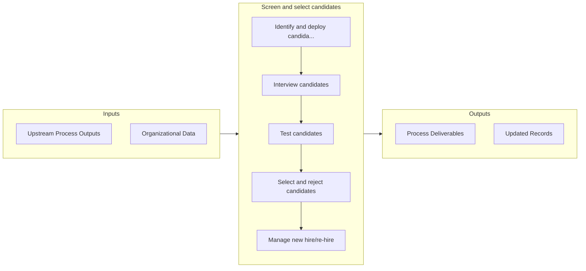

# Screen and select candidates

> Evaluating and selecting potential employees through interviews, tests, etc.

## Overview

Process 7.2.3 is a core process that defines the specific procedures for screen and select candidates. 

Evaluating and selecting potential employees through interviews, tests, etc.

## Process Hierarchy



## Key Statistics

| Metric | Value |
|--------|-------|
| APQC Code | 20123 |
| Hierarchy ID | 7.2.3 |
| Level | Process |
| Parent | [7.2](../) |
| Sub-Processes | 5 |


## GraphDL Semantic Structure

```
screen.AndSelectCandidates
```

| Component | Value | Description |
|-----------|-------|-------------|
| Verb | `screen` | Primary action |
| Object | `and select candidates` | Direct object |


## Process Flow



## Sub-Processes

| Process | Hierarchy ID | Description |
|---------|-------------|-------------|
| [Identify and deploy candidate selection tools](./IdentifyAndDeployCandidateSelectionTools) | 7.2.3.1 | Identifying and implementing tools for the selection of candidates |
| [Interview candidates](./InterviewCandidates) | 7.2.3.2 | Assessing the candidates by their performance in the interviews |
| [Test candidates](./TestCandidates) | 7.2.3.3 | Examining the candidates through tests |
| [Select and reject candidates](./SelectAndRejectCandidates) | 7.2.3.4 | Approving the deserving candidates, and rejecting the others |
| [Manage new hire/re-hire](./ManageNewHirerehire) | 7.2.3.5 | Creating and making job offers to the selected candidates |


## Related Concepts

- Candidates
- Candidates


---

*Source: APQC PCF 20123 (7.2.3) - APQC*
