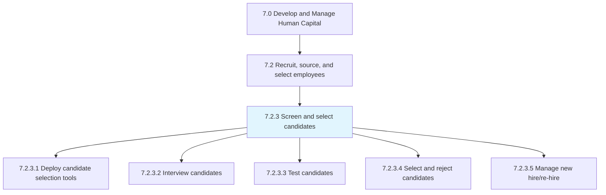
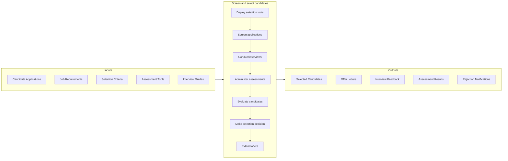

# Screen and select candidates

> Evaluating and selecting potential employees through interviews, tests, etc.

## Overview

Process 7.2.3 is a core process within [Recruit, Source, and Select Employees](../) that evaluates candidates against job requirements and organizational fit to identify the best hires. This process applies structured assessment methods to predict candidate success while ensuring fair, compliant, and positive candidate experiences.

Effective candidate screening combines multiple assessment approaches including resume review, phone screens, structured interviews, skills assessments, cognitive tests, and reference checks. Modern approaches leverage AI-powered screening tools, video interviews, and standardized scorecards while guarding against bias. The process must balance thoroughness with speed to compete for top talent.

## Process Hierarchy



## Key Statistics

| Metric | Value |
|--------|-------|
| APQC Code | 20123 |
| Hierarchy ID | 7.2.3 |
| Level | Process |
| Parent | [7.2](../) |
| Sub-Processes | 5 |

## GraphDL Semantic Structure

```graphdl
screen.Candidates.for.Selection
```

| Component | Value | Description |
|-----------|-------|-------------|
| Verb | `screen` | Primary action of evaluating |
| Object | `Candidates` | Job applicants being assessed |
| Preposition | `for` | Purpose relationship |
| PrepObject | `Selection` | Hiring decision |

## Process Flow



## Sub-Processes

| Process | Hierarchy ID | Description |
|---------|-------------|-------------|
| [Identify and deploy candidate selection tools](./IdentifyAndDeployCandidateSelectionTools) | 7.2.3.1 | Implementing assessment platforms, interview guides, and evaluation criteria |
| [Interview candidates](./InterviewCandidates) | 7.2.3.2 | Conducting structured interviews to assess fit and capabilities |
| [Test candidates](./TestCandidates) | 7.2.3.3 | Administering skills assessments, cognitive tests, and simulations |
| [Select and reject candidates](./SelectAndRejectCandidates) | 7.2.3.4 | Making hiring decisions and providing respectful rejections |
| [Manage new hire/re-hire](./ManageNewHirerehire) | 7.2.3.5 | Creating offers and transitioning selected candidates to onboarding |

## RACI Matrix

| Activity | Responsible | Accountable | Consulted | Informed |
|----------|-------------|-------------|-----------|----------|
| Define selection criteria | Recruiting Manager | HR Director | Hiring Manager | Recruiters |
| Screen applications | Recruiters | Recruiting Manager | Hiring Manager | Candidates |
| Conduct phone screens | Recruiters | Recruiting Manager | Hiring Manager | Candidates |
| Facilitate interviews | Recruiters | Hiring Manager | Interview Team | HR Operations |
| Administer assessments | Recruiters | Recruiting Manager | Hiring Manager | Candidates |
| Make hiring decision | Hiring Manager | Business Leader | HR, Recruiting | Candidates |
| Extend offers | Recruiters | Recruiting Manager | Compensation | Candidates |

## Key Stakeholders

- **Recruiters**: Screen candidates and coordinate process
- **Hiring Managers**: Define requirements, interview, decide
- **Interview Teams**: Assess candidates from multiple perspectives
- **HR Operations**: Ensures compliance and process integrity
- **Candidates**: Experience the selection process
- **Assessment Vendors**: Provide testing platforms

## Metrics and KPIs

| Metric | Description | Target |
|--------|-------------|--------|
| Time to Screen | Days from application to screening decision | <5 days |
| Interview-to-Offer Ratio | Interviews needed per offer | <4:1 |
| Offer Acceptance Rate | Offers accepted / offers extended | >85% |
| Quality of Hire | New hire performance at 12 months | >80% meet expectations |
| Candidate Experience Score | Candidate satisfaction with process | >4.0/5.0 |
| Interviewer Training | Interviewers completing bias training | 100% |
| Assessment Validity | Correlation of assessments to performance | >0.3 |
| Adverse Impact Ratio | Selection rates across demographics | >80% (4/5ths rule) |

## Related Departments

- [Human Resources](/departments/HumanResources) - Recruiting operations
- [All Departments](/departments) - Hiring manager participation
- [Legal](/departments/Legal) - Compliance oversight

## Related Occupations

- [Human Resources Specialists](/occupations/Business/HumanResourcesSpecialists) - Recruiting coordination
- [Human Resources Managers](/occupations/Management/HumanResourcesManagers) - Process oversight
- [Industrial-Organizational Psychologists](/occupations/LifeSciences/Psychologists) - Assessment design

## Related Concepts

- StructuredInterviews
- CandidateAssessment
- SelectionCriteria
- HiringDecisions
- CandidateExperience
- BiasReduction
- PredictiveHiring

---

*Source: APQC PCF 20123 (7.2.3) - APQC*
