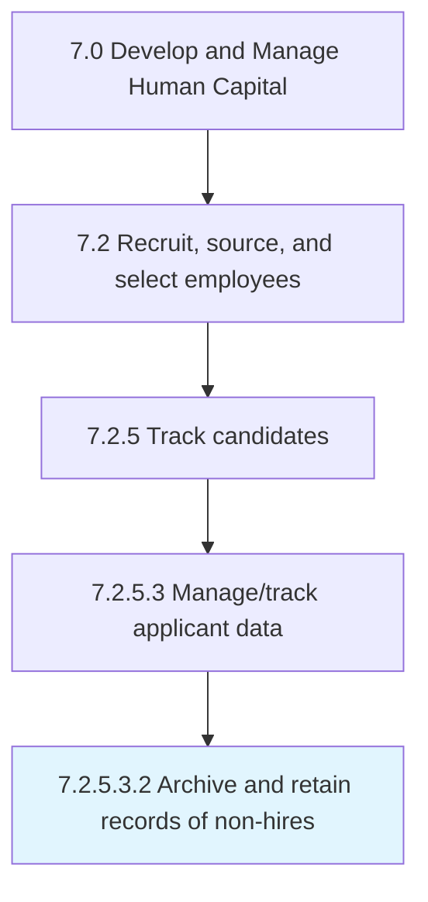

# Archive and retain records of non-hires

> Retaining and storing the records of the candidates who were rejected and not hired to ensure future availability in case the need arises.

## Overview

Sub-Activity 7.2.5.3.2 is an activity within the Develop and Manage Human Capital framework. 

Retaining and storing the records of the candidates who were rejected and not hired to ensure future availability in case the need arises. Create a centralized repository of profiles. Label these records in order to readily identify them. Add remarks for any future consideration.

## Process Hierarchy



## Key Statistics

| Metric | Value |
|--------|-------|
| APQC Code | 10468 |
| Hierarchy ID | 7.2.5.3.2 |
| Level | Sub-Activity |
| Parent | [7.2.5.3](../) |
| Sub-Processes | 0 |


## GraphDL Semantic Structure

```
archive.AndRetainRecords.of.Nonhires
```

| Component | Value | Description |
|-----------|-------|-------------|
| Verb | `archive` | Primary action |
| Object | `and retain records` | Direct object |
| Preposition | `of` | Relationship |
| PrepObject | `non-hires` | Indirect object |


---

*Source: APQC PCF 10468 (7.2.5.3.2) - APQC*
