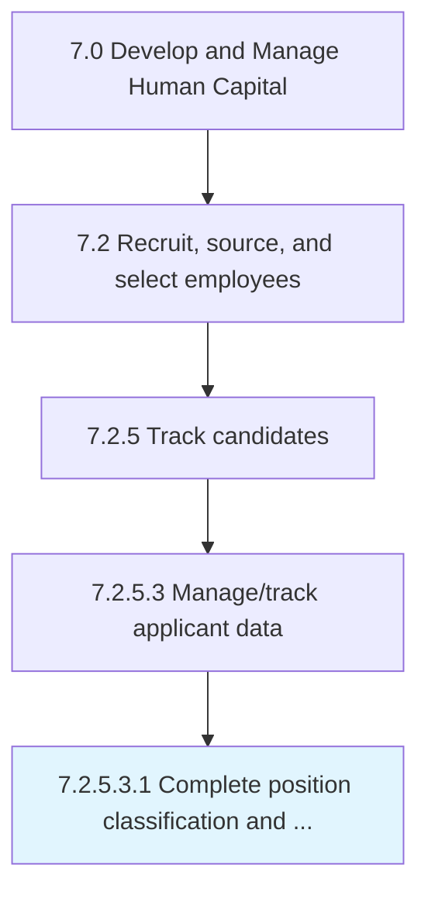

# Complete position classification and level of experience

> Identifying the requirements for the position to be filled.

## Overview

Sub-Activity 7.2.5.3.1 is an activity within the Develop and Manage Human Capital framework. 

Identifying the requirements for the position to be filled. Determine the experience and skills necessary to perform the tasks outlined.

## Process Hierarchy



## Key Statistics

| Metric | Value |
|--------|-------|
| APQC Code | 20124 |
| Hierarchy ID | 7.2.5.3.1 |
| Level | Sub-Activity |
| Parent | [7.2.5.3](../) |
| Sub-Processes | 0 |


## GraphDL Semantic Structure

```
complete.PositionClassificationAndLevel.of.Experience
```

| Component | Value | Description |
|-----------|-------|-------------|
| Verb | `complete` | Primary action |
| Object | `position classification and level` | Direct object |
| Preposition | `of` | Relationship |
| PrepObject | `experience` | Indirect object |


## Related Concepts

- PositionClassification
- Experience
- Level
- Experience


---

*Source: APQC PCF 20124 (7.2.5.3.1) - APQC*
